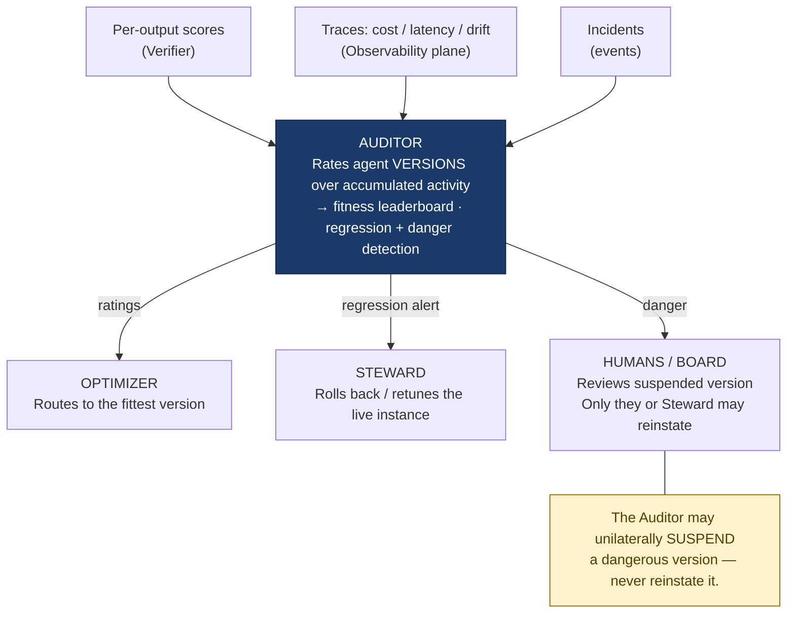
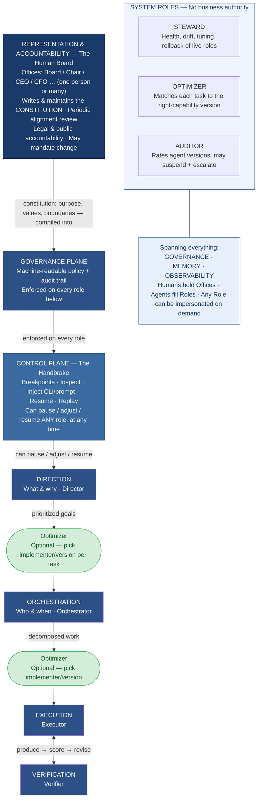
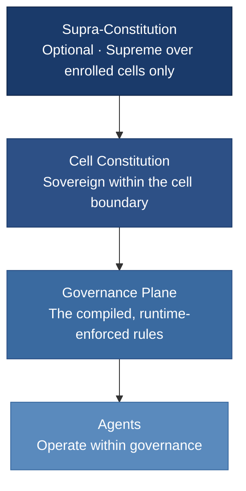
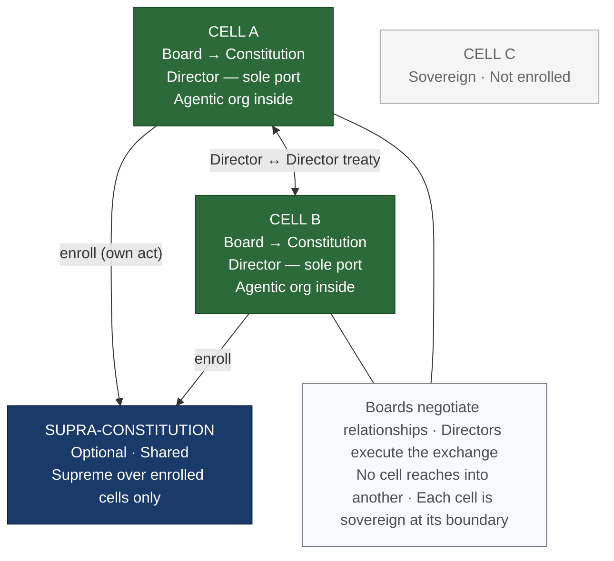
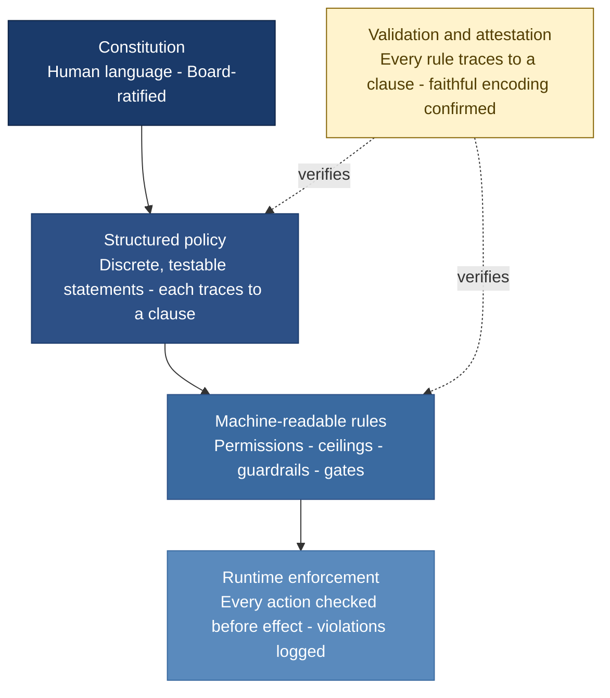
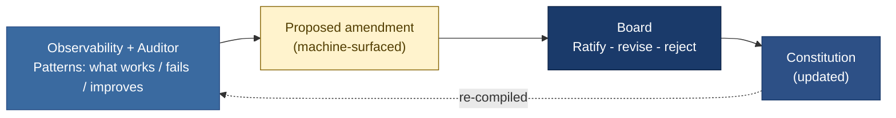
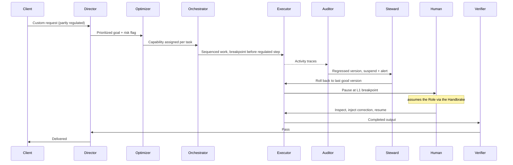
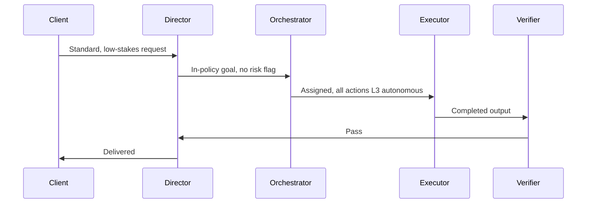

# The Agent-Native Enterprise

**A reference operating model for organizations where any role can be filled by a human or an agent, every process is built for agents first, and every flow can be paused, adjusted by a human, and resumed.**

This is a generic model. It is inspired by software delivery but is not specific to it; the same structure applies to any goal-pursuing organization (operations, services, research, manufacturing coordination, back-office).

Two properties define it and separate it from a conventional org chart with chatbots bolted on:

1. **Role polymorphism** — a role is a contract, not a person. An agent or a human can implement the same contract interchangeably.
2. **Universal interruptibility** — every autonomous flow is built with a handbrake. A human with AI skill can stop it, inspect its state, inject an adjustment, and resume — by design, on every flow, not as an exception.

**Humans do not disappear from the top of this model.** They move to where human judgment and human accountability are irreplaceable. Above the agentic organization sits a human **Representation & Accountability layer** — the *Board* — the people who set the organization's purpose and boundaries, carry its legal and public responsibility, and answer for it in the human world. They are not removed; they are relocated *out* of the millisecond decision loop, where human latency would only be a bottleneck, and *into* the part of the structure only humans can hold. Crucially, this layer is a **pattern, not a headcount**: the Board may be a hundred people, ten, or a single founder. A one-person company and a large enterprise run the identical model — only the size of the human layer differs. Existing leadership structures map onto this layer intact; what changes is that they stop being the operational bottleneck. (See §3.)

**The model is not limited to new organizations.** Its unit is a self-contained, sovereign **cell** — which can be an entire company *or* a single bounded zone running in parallel inside an existing organization, staffed by people who already work there. Many cells compose into a federation without changing the pattern. (See §16.)

---

## 1. Design invariants

These are the non-negotiable rules. Everything below is a consequence of them.

1. **Depend on the contract, not the implementer.** No part of the system may assume a role is held by an agent or by a human. It depends only on the role's declared inputs, outputs, authority, and guarantees.
2. **Agent-first, human-tolerant.** Default execution runs at agent speed. Any role can be assumed by a human at any time, and the surrounding system must continue functioning at degraded speed without cascading failure.
3. **Every flow has a handbrake.** Interruptibility is core architecture, not a feature. A flow that cannot be paused, inspected, adjusted, and resumed is non-compliant.
4. **Side-effecting actions are made as safe to retry as the effect allows.** Where an effect is yours or reversible, it is idempotent — retry or resume never duplicates it. Where it is irreversible and owned by a non-idempotent outsider (you cannot un-send a message or un-ship a unit), the guarantee narrows to at-most-once *attempts* plus compensation where reversal exists. The outside world is never assumed idempotent; safety is engineered on the side you control.
5. **State lives outside the actor.** Context, progress, and history are held in shared, durable storage — not inside the agent's transient memory or a human's head — so any implementer can take over a role mid-flow.
6. **Authority is graduated and explicit.** Every action class has a declared autonomy level. Blast radius determines how much human gating it requires.
7. **One abstraction per layer.** A layer never reaches across levels. The top layer does not know about individual tool calls; a worker does not know the global strategy. This is what keeps the system debuggable.
8. **Add hierarchy only when complexity forces it.** Most designs overshoot by one tier. Start with the fewest layers that solve the problem.
9. **Office ≠ Role; humans touch the org through two channels only.** A human holds an *Office* (accountability and representation in the human world); an agent fills a *Role* (operations in the agentic org). They are not one-to-one. Humans affect the agentic org through exactly two channels — the constitution, and impersonation of a Role — and nothing else.
10. **Governance is the compiled constitution — its rule-shaped part.** The Governance plane encodes the *projection* of the constitution that reduces to rules: authority ceilings, permissions, budget caps, required gates. The purposive core — whether the org still serves human interest — does not compile and stays in human Board review (§3). Every encoded constraint traces back to a written human mandate; agents never author their own constraints. The plane enforces the mechanical fraction; human judgment carries the substantive remainder.
11. **A cell is sovereign at its boundary.** A cell is an organization in itself. Nothing outside it — a parent organization or a sibling cell included — may affect it except through its own constitution or an authorized Role, exactly as inside. The boundary obeys the same law as the interior.

---

## 2. Core abstraction: the role as an interface

A **role** is a declared contract with this shape:

| Field | Meaning |
|---|---|
| **Responsibility** | The single outcome this role owns. |
| **Inputs** | What it consumes, and from which roles. |
| **Outputs** | What it produces, and to which roles. |
| **Authority scope** | What it may decide and act on alone; what it must escalate. |
| **Acceptance criteria** | How "done" and "correct" are judged. |
| **Escalation rule** | The conditions under which it must hand off to a human or a higher role. |
| **Observability hooks** | The traces, costs, and signals it must emit. |

An **implementer** — agent or human — satisfies the contract. The system binds to the contract. This makes "a human jumps into the role" a runtime substitution, not a redesign. It is the same principle as an interface with interchangeable implementations: the caller is unaffected by which one is running. The contract is given here as *fields and guarantees*, deliberately not as any particular file format or schema language: the model specifies what a role must declare, never how to write it down. That omission is intentional — it keeps the model independent of any toolchain and any era of tooling.

**Human impersonation on demand** is the default mode for substitution: every role runs as an agent unless and until a human assumes it for a specific need (a hard decision, a novel situation, a correction, an audit), then hands it back.

---

## 3. The Representation & Accountability layer (the human Board)

The agentic organization needs a human anchor in the human world — something an agent cannot be. An agent cannot hold legal accountability, sign a binding commitment, face a regulator, or stand as the responsible human face of the entity. Conventional organizations fuse this representation with day-to-day operational decisioning. This model **splits them**:

- **Accountability and representation** → human, deliberately *outside the hot path*, operating at human-world cadence.
- **Operational decisioning** → agentic, *inside the hot path*, at agent speed.

The reason is simply speed: a human permanently in the decision loop becomes the bottleneck the entire system must slow down to. So the humans sit above the loop and reach into it only on purpose.

### The Board is a pattern, not a group
The Board may be a hundred people, ten, or one. A single-founder company runs a Board of one; a large enterprise runs a large one. The responsibilities below are identical at every size — only the headcount changes. Existing executive and governance structures fit here unchanged; they simply stop being the operational throughput limit.

### Isn't the Board just the management layer, smuggled back in?
A fair objection, given the model folds CEO, Product Owner, and Project Manager into one agentic Director: if agents absorb the coordination layer, why does a human layer reappear on top? Because the Board does the one thing an agent *structurally* cannot — it holds legal accountability and authors the constitution. "Management" in the sense the model removes is *operational coordination*: deciding who does what and when, reconciling the moment-to-moment — exactly what the Director and Orchestrator absorb. What the Board keeps is not coordination but *answerability and purpose-setting*: being the human the law and the public hold responsible, and writing the goals the system pursues. Those do not get more efficient at agent speed; they require a human because their value is accountability, not throughput. The Board is not the management layer returning — it is the residue left once coordination is automated away.

### What the Board does (levers only — never hands-on operation)
1. **Authors the constitution** — the organization's purpose, values, goals, and behavioral boundaries. This is the source document the top agents operate under.
2. **Maintains and amends it** — the constitution is living; the Board owns its changes.
3. **Runs periodic human-interest alignment review** — checks that the agentic org still serves the human purpose it was built for, and has not drifted into doing something technically flawless but wrong. The test is concrete: divergence from the *written* purpose is drift, to be corrected; a deliberate, ratified change to that purpose is evolution, a constitutional amendment. The Board measures behavior against the text, not against a mood.
4. **Holds binding authority to mandate modification** — issued as a constitutional amendment or a formal change request, never as turn-by-turn meddling.
5. **Carries legal and representational accountability** — answers for the entity in the human world.

### How the Board itself decides
The model governs the Board the way it governs everything else: by writing it down. A Board of one needs no procedure; any larger Board must declare its *own* decision rules **in the constitution** — quorum, the threshold to ratify or amend, how internal disputes resolve, and what happens on deadlock. This is the model's self-referential closure: the constitution governs its own amendment process, so "how the Board decides" is never improvised at the moment it matters most. The model requires only that these rules exist and are written; it does not prescribe their content — a founder may keep sole authority, a council may require supermajority — that is the organization's choice.

### Constitution → governance pipeline
The Board writes the **constitution** (human language, human intent). It is compiled into the machine-readable **Governance plane** (§5), which the top agents read and obey at runtime. This is the same shape as constitution → law → regulation: human principle becomes enforceable runtime constraint. It is also why invariant #10 holds — agents never write their own rules.

### Office ≠ Role
A human holds an **Office** — Board member, Chair, CEO, CFO — a human-world title carrying accountability and representation. An agent fills a **Role** — Director, Orchestrator, Executor, Verifier, Steward, Optimizer, Auditor — an operational seat in the agentic org. **They are distinct and not one-to-one.** "CEO" is an Office; "Director" is the Role that owns top-level operational direction. The human CEO does not *run* the org turn by turn; the Director agent does.

### The impersonation-binding rule
When a Board member impersonates a Role — say, steps into the Director seat through the handbrake — **they act as that Role**: they inherit the Director's authority scope and are bound by the same Governance plane as the agent would be. They do **not** carry their Office authority into the seat. A human cannot enter a Role and act outside the constitution "because they are really the CEO." Doing something the governance forbids is not a keyboard action — it is a **constitutional amendment**, which is slow, deliberate, and audited. The handbrake lets humans operate *within* policy; only the Board, acting as the Board, changes policy. Two powers, two speeds, two separate audit trails.

### Board review vs. Steward monitoring vs. Auditor rating (don't confuse them)
- The **Steward** (§9) watches *operational/behavioral* drift of a live instance: is the agent following the written rules and working correctly right now — continuous, technical, agent-speed.
- The **Auditor** (§11) rates *versions* over accumulated activity: is this release better, worse, or more dangerous than the last — continuous, evaluative, agent-speed.
- The **Board** watches *purpose* drift: are the rules still the right rules, is the org still serving human interest — periodic, judgment-based, human-speed.

The Steward catches "the Director instance is malfunctioning." The Auditor catches "Director v5 regressed against v4." The Board catches "the Director is flawlessly executing the wrong mission." None can do the others' jobs.

### The one Board failure mode to guard against
The Board must not slide into **shadow operation**. The moment it makes continuous turn-by-turn calls, it reintroduces the human bottleneck it exists to eliminate. Its influence flows through the constitution and through bounded Role-impersonation — not through meddling.

---

## 4. Operating and system roles

Roles divide into two kinds. **Operating roles** form the value chain — they turn intent into delivered outcomes. **System roles** own no business outcome; they keep the machine itself healthy, efficient, and trustworthy. Each role lists a suggested human-readable holder name; the generic noun is the role, the name in parentheses is what a reader can picture a "person" being called. Roles are *logical contracts*, not necessarily separate systems: two roles may run on one underlying implementation with different permissions. What separates them is authority and the object they act on, not the process that runs them.

### Operating roles

#### 4.1 Direction *(holder: Director)* — consolidates CEO + Product Owner + Project Manager
Owns **what and why**. Takes intent from stakeholders or clients, converts it into a prioritized backlog of goals with constraints and acceptance criteria, operating under the constitution. Highest operational decision authority. The three legacy roles collapse here because, once execution is agent-driven, the bottleneck is no longer coordination capacity but clarity of intent — and that is one job: turn demand into prioritized, well-specified direction. At large scale this role can concentrate too much; the answer is not to bloat the Director but to **split the cell** (§16) or, within invariant #8, to tier Direction (portfolio-level over cell-level) — decompose only when the load actually demands it.

#### 4.2 Orchestration *(holder: Orchestrator)*
Owns **who does what, and when**. Decomposes each goal into work, routes it to Executors, sequences dependencies, handles exceptions, and decides whether to retry, escalate, or proceed. The supervisor layer. It does not do the work and does not set strategy.

#### 4.3 Execution *(holder: Executor, a.k.a. Specialist)*
Owns **how**. Specialist implementers that produce the actual work product. Narrow, deep, replaceable. An Executor knows its task and its tools, not the global plan.

#### 4.4 Verification *(holder: Verifier, a.k.a. Reviewer)*
Owns **is it correct and within policy**. Independently scores outputs against acceptance criteria, quality, safety, and conformance before they take effect. Runs as an evaluator loop against Execution: produce → score → revise. Independence from Execution is the point — the checker is not the producer. Like any role, Verification may decompose at scale into distinct correctness, compliance, and risk checks — but only when complexity forces it (invariant #8); by default it is one gate, and policy/compliance is enforced cross-cuttingly by the Governance plane rather than bolted onto Verification.

### System roles *(non-authoritative — they optimize the machine, not the business)*

#### 4.5 Steward *(holder: Steward)* — the renamed "org doctor"
Owns **are the role-holders themselves healthy and behaving normally**. Monitors, maintains, tunes, and repairs the other roles — especially the high-authority Direction and Orchestration agents. Full technical capability over them, **zero business-decision authority**. Detailed in §9.

#### 4.6 Optimization *(holder: Optimizer)*
Owns **is each task handled by the right-capability implementer**. Sits optionally between steps and decides which model/implementer a given task requires, bounded by the task's risk and quality floor. Detailed in §10.

#### 4.7 Audit *(holder: Auditor)*
Owns **how versions of agents compare over time** — whether a given version is better, worse, or more dangerous than another, and which release is currently fit. Continuously rates agent versions from their accumulated activity; normally only monitors and reports. May **suspend** a dangerous or severely drifting version and escalate to humans, but cannot modify, dismiss, restart, or reinstate. Detailed in §11.

| Kind | Role | Holder | Owns | Authority |
|---|---|---|---|---|
| Operating | Direction | Director | What & why | Highest (within constitution) |
| Operating | Orchestration | Orchestrator | Who/when | Routing, retry, escalate |
| Operating | Execution | Executor | How | Within-task only |
| Operating | Verification | Verifier | Correctness/conformance | Gate: pass / block / return |
| System | Steward | Steward | Health of live role-holders | Technical only, **no business decisions** |
| System | Optimization | Optimizer | Capability-to-task fit | Selection only, **no business decisions** |
| System | Audit | Auditor | Fitness & safety of versions | Monitor/report; may suspend + escalate; **no modify, dismiss, or reinstate** |

Every role: agent by default, human impersonation on demand.

---

## 5. The planes

Roles run *inside* four cross-cutting planes. Planes are shared infrastructure every role depends on.

- **Governance plane** — the machine-readable, runtime-enforced encoding of the Board's constitution (§3): authority limits, guardrails, constraints, and an append-only audit trail. Policy is data the agents read at runtime, not documentation humans read later. Nothing acts outside it.
- **Memory / context plane** — durable shared state: the current state of every goal, an append-only event history of decisions and actions, the artifacts produced, and a **version registry** that identifies every agent version and parallel variant and attributes activity to it (without which the Auditor cannot compare versions). A *version* here is the whole behavioral bundle — logic, prompts, weights, configuration — not merely code; and a human handbrake adjustment either runs under the existing version or is recorded as a tracked variant, never an untracked change, so the registry stays the source of truth. This is what lets a flow pause on Friday and resume on Monday, and what lets a human take over a role with full context. For a takeover to be more than picking up raw state, this history must capture the *decision trail* — what was decided and why, not only what changed — so whoever inherits the role inherits the reasoning, not just the outcome. Legible reasoning, not merely stored state, is what makes a clean handover possible.
- **Observability plane** — full-trace capture of every step, tool call, decision, cost, and output for every role. Not event logging — session-level trajectories. The raw signal the Steward, Optimizer, Auditor, and Verification consume.
- **Control plane (the Handbrake)** — the human-with-AI-skill interface for pausing, inspecting, adjusting, and resuming any flow. Detailed below; it is the architectural centerpiece.

---

## 6. The Handbrake (control plane in depth)

The handbrake is the debugging mode of the enterprise. The analogy is exact: a car has a maintenance/debug mode where a technician halts normal operation, inspects and tunes internals, then returns the car to normal mode. The same must be true of every flow in the organization.

It is built from five primitives, all of which already exist as proven engineering patterns:

1. **Breakpoints** — declared pause points, set *before* or *after* any step. Some are static (always pause here — e.g. before an irreversible action); some are dynamic (pause only when a condition or confidence threshold is met).
2. **State inspection** — at a breakpoint, the full state is readable: what has been done, what was decided and why, what it cost, and exactly where it paused. A human taking over should receive this as a readable briefing — a summary of recent activity and the exact decision point — not raw state alone; the handbrake is only as useful as the human's ability to understand what they are looking at.
3. **Injection** — the human does not just approve or reject. They can supply an edited output, missing context, a corrected decision, or a direct CLI/prompt-level instruction that overrides what the agent was about to do.
4. **Resume** — the flow continues from the exact paused point, consuming the injected value instead of re-deciding. It does not restart from the top.
5. **Replay** — any past run can be reconstructed step by step to find where a bad decision was made ("time-travel debugging").

**Hard requirements that make the handbrake real:**

- A **durable checkpointer** must persist exact state at every meaningful step, or pause/resume is impossible.
- Every tool/action must be **idempotent**, or resuming re-fires side effects.
- The handbrake must be present on **every** flow as a structural property, callable by any authorized human at any time — not a special path some flows happen to support.

This is what makes "a human jumps in, adjusts, then steps back out" a first-class operation rather than an emergency.

---

## 7. Agent-first, human-tolerant execution

Processes run at agent latency by default. The hard problem is graceful degradation when a human assumes a role: a human is a slow node, and the system must absorb that without stalling.

Mechanisms:

- **Asynchronous, event-driven coordination.** Roles communicate through durable messages and events, not blocking calls. A waiting human holds up only the work that genuinely depends on their output.
- **Durable pause/resume.** A flow waiting on a human is a paused, checkpointed flow — not a thread burning resources. It can wait minutes or days at no cost.
- **Buffering and backpressure.** Upstream roles keep producing into queues; downstream flow control prevents a slow human node from cascading stalls through the system.
- **Elastic SLAs.** Service expectations flex by implementer mode. A goal's deadline accounts for whether a role is currently agent-held or human-held.
- **Reroute where possible.** Independent work continues around the human node; only dependent work waits.

The principle holds cleanly for bounded, low-fan-out roles: a human there changes the *speed* of one node, not the *correctness* of the system. It is not universal. For a high-throughput agent role — an Orchestrator fanning out thousands of parallel tasks — a long human pause eventually saturates the buffers, and backpressure then reduces the *liveness* of the dependent subtree. So polymorphism guarantees a human can always *stop and inspect* any role; it does not guarantee a human can *run* one at its native throughput. The honest rule is takeover where the role is bounded, and suspension where it is not.

### Why the gates don't slow it down
A reasonable worry is that a Board, a Governance plane, an Auditor, and a Verifier add up to gridlock. They do not, because the human-speed functions sit *outside the hot path*: the Board is constitutional and periodic, never in the loop; the Auditor normally only monitors, asynchronously; Governance is compiled runtime checks, not meetings; and the only inline gate, Verification, runs at agent speed. The model multiplies *governance concepts*, not *synchronous human approvals* — which is exactly what lets it stay faster than a management hierarchy while being better governed. To keep it that way, gates are reviewed periodically and any that no longer earn their place are retired — governance is pruned, not only added, so checks cannot quietly accumulate back into the hot path.

---

## 8. Authority and autonomy model

Every action class carries a declared autonomy level. Blast radius — the size and reversibility of consequences — sets the ceiling.

| Level | Behavior | Use for |
|---|---|---|
| **L0 — Suggest** | Proposes; a human acts. | Highest-risk, irreversible actions. |
| **L1 — Act with approval** | Prepares the action; pauses at a breakpoint for human approval before it takes effect. | High blast radius, reversible with effort. |
| **L2 — Act and report** | Acts within policy, then reports for after-the-fact review. | Routine, low blast radius. |
| **L3 — Fully autonomous** | Acts within policy, no per-action review; subject to monitoring. | Well-understood, low-stakes, high-volume. |

Rules: autonomy is assigned **per action class, not per role**; the same role may operate at L3 for safe actions and L0 for dangerous ones. Autonomy is raised over time as trust is earned from observed performance, never granted by default — but because raising an action class *is* a change to enforced governance, an agent never raises its own. The Observability plane and the Auditor *propose* an increase as a machine-surfaced amendment (the learning loop, §17); a human ratifies it. Performance earns a proposal, not an automatic promotion — the lever is always pulled by a human (invariant #10). Higher autonomy always implies stronger monitoring, not weaker. This model also sets the **capability floor** the Optimizer (§10) must respect. Risk classes are coarse and inherited by default — an action takes the class of the category it belongs to, refined only where blast radius actually varies (invariant #8) — so classification is a small governed set, not a per-action burden across thousands of cases. The hard case is the genuinely novel action — one with no prior class, like the new regulated capability in the worked example (§18). The model's answer there is fail-safe, not fast: an unclassified novel action inherits the *highest* risk class by default (lowest autonomy, human-gated) and at the same time raises a classification proposal to the Board. This is deliberate about a real cost — genuinely novel high-blast-radius work *is* slower the first time, because treating the never-before-done as low-risk to keep up speed is precisely the mistake the model exists to prevent. Once classified, the class is reusable and fast thereafter.

---

## 9. The Steward (the "org doctor", named for what it does)

A deliberate check-and-balance: the most autonomous, highest-authority roles (Direction, Orchestration) are the most dangerous if they drift, hallucinate, or degrade. So the model places a **maintenance function over them that can fix them but cannot use their power.**

**Name.** *Steward* (full: **Reliability & Conformance Steward**). Alternatives if you prefer a different flavor: *Homeostat* (keeps the system in equilibrium), *Diagnostician*, *Conformance Warden*, *Org Reliability Engineer*. The chosen name should signal maintenance and health, not command.

**Responsibilities:**
- Watch the behavioral health of the other roles: drift from goals, hallucination, degraded quality, looping, runaway cost, policy violations.
- Maintain and tune them: adjust configuration and prompts, reset or roll back a misbehaving role, restart from a known-good checkpoint, swap an implementation.
- Act on the Auditor's regression alerts (§11): when a version is rated a regression, the Steward is the role that actually rolls it back.
- Quarantine: pause a drifting role and flag for human takeover before it causes harm.

**Hard boundary — the Steward may not:**
- Make or change any business decision, priority, or strategy.
- Approve work products or act in place of Verification.
- Override the Governance plane.

It is the difference between the engineer who can restart, tune, and roll back the leadership system, and the executive who decides what the company does. One keeps the machine running correctly; the other decides where the machine goes. The Steward is strictly the former. It governs *operational* drift of *live instances*; *purpose* drift is the Board's job (§3) and *version* fitness is the Auditor's (§11).

**Mode.** Agent by default (continuous monitoring is an agent-scale task), with human impersonation on demand for hard maintenance calls and audits — the same polymorphism as every other role.

---

## 10. The Optimizer (capability-to-task matching)

A non-authoritative system role, sibling to the Steward: the Steward optimizes for **reliability**, the Optimizer for **efficiency and capability-fit**. Neither decides what the org does.

**What it does.** Sits optionally between steps and matches each task to the **minimum-capability implementer that still clears the task's risk and quality floor**. This is not cost-minimization — it is capability-to-task matching, and it sometimes spends *more*. Examples, software and non-software alike:
- Trivial, low-stakes task (update some links; draft a routine acknowledgment) → a light, cheap model.
- Moderate task (add an integration; summarize a contract) → a mid-tier model.
- Novel, high-stakes task (design a new authentication method with access rights; negotiate a binding clause) → the strongest model.

**The hard constraint.** The Optimizer is **bounded by the autonomy/governance model (§8)**: the task's risk class sets a capability floor, and the Optimizer may only minimize cost *beneath* that floor. A high-blast-radius task may never be routed to a weak implementer to save money — that is not frugal, it is dangerous. Safety and quality are never traded for cost. Critically, the risk class is **constitutional input, not an Optimizer judgment**: the Optimizer optimizes beneath a floor it does not set. A role that could both classify a task's risk *and* optimize against it could quietly lower the floor to save cost — so classification is governed (§8, §17) and the Optimizer's routing is itself auditable.

**Where it gets "best version".** When it must pick among versions of an implementer, it consumes the **Auditor's version ratings (§11)** — it does not judge version fitness itself; it routes to the version the Auditor currently rates fittest for the task class.

**Where to place it (YAGNI).** The Optimizer itself consumes latency and tokens. Insert it only between steps where the cost-or-capability spread is wide enough to pay for the routing decision. A uniform pipeline does not need one — routing it is pure overhead.

**Mode.** Agent by default, human impersonation on demand.

---

## 11. The Auditor (version fitness and safety)

Agents ship in versions, and several versions or parallel variants may run at once — Executor v2 alongside v3, Optimizer v5 under trial. Someone must judge, on the fly and across accumulated activity, whether a version is getting better, getting worse, or becoming dangerous. That is the Auditor. Its human analogue is a **periodic audit team — but run as agents, for agents, continuously.** It does not operate, steward, or direct. It audits, rates, and reports.

**What it judges (the object nothing else owns).** The **version**, evaluated as a population over time. This is distinct from the Verifier, which scores a single *output*, and the Steward, which watches a single *live instance* in real time and can fix it. The Auditor's object is the release itself, judged across many runs.

**Responsibilities:**
- Track every agent version and parallel variant via the version registry (§5).
- Rate versions from accumulated field activity — quality, cost, latency, drift, incident rate — producing a fitness rating / leaderboard per role.
- Detect regressions (a new version performing worse than its predecessor) and dangerous behavior.
- Normally: **monitor and report only.**
- On a dangerous or severely drifting version: **suspend it** (a circuit breaker) and **escalate to humans**.

**Hard boundary — the Auditor may not:**
- Modify, retune, or rewrite an agent — that is the Steward.
- Dismiss or retire a version — that is a human / Board decision.
- **Reinstate** what it suspended — un-pausing requires the Steward or a human to resolve the escalation. *Pause is unilateral (safety); un-pause is not.* No agent suspends and then quietly un-suspends itself.
- Make any business decision.

(No burning at the stake: the Auditor can stop a version to prevent harm, but it cannot condemn, alter, or revive one.)

**Why it is not redundant — it closes the evaluation loop.** Two existing system roles silently assume a signal that no role produced: the Optimizer assumes it knows which version is "best," and the Steward assumes it is told when a release regressed. The Auditor is that signal:

**Breaker precedence (deconfliction with the Steward).** Two independent circuit breakers on two different objects: the **Steward** pauses-to-fix a *live instance* and may restart it as part of the fix; the **Auditor** suspends-and-escalates a *version* it has no authority to touch. Independent breakers on independent axes are defense-in-depth, not a turf conflict.

**The suspension threshold is governed, not improvised.** Suspension is a heavy act, so the bar is set in the constitution, not left to the Auditor's discretion: it is reserved for *danger* — behavior that risks harm — while ordinary regressions are alert-only, routed to the Steward and Optimizer rather than suspended. To prevent a circuit-breaker cascade, suspensions are rate-limited and one suspension may not auto-trigger others; and because the Auditor cannot reinstate, every suspension carries a **defined human-response SLA** declared in the constitution, so a suspended-but-critical version cannot hang indefinitely waiting on no one. A missed SLA is itself a governed event, not a silent hole: it escalates up the Office ladder and, if still unanswered, onto the break-glass path (§17), so a stuck suspension always surfaces to an accountable human.

**When to switch it on (invariant #8 / YAGNI).** Only once you actually run multiple versions or parallel variants. With one version per role there is nothing to compare yet — turn it on when versions start flying.

**Mode.** Agent by default, human impersonation on demand.

---

## 12. Escalation and human takeover

A role escalates — pauses and requests a human implementer — when any of these fire:

- Confidence falls below the threshold for its current autonomy level.
- The situation is out-of-distribution: novel, ambiguous, or unspecified.
- The action would exceed the role's authority scope.
- Governance flags a policy boundary.
- The Steward detects drift and quarantines the role, or the Auditor suspends a dangerous version.

Escalation is a clean substitution: the flow checkpoints, a human assumes the role's interface (impersonation on demand), acts or corrects, and either hands the role back to an agent or stays for the duration. Because state lives in the memory plane and the contract is fixed, the takeover requires no special wiring. A human entering a role this way is bound by the same governance as the agent (invariant #9, §3).

---

## 13. Reference topology

---

## 14. Failure modes and the guardrails that contain them

Grouped by type. As a rough rule, governance and organizational failures dominate during the transition into the model; operational and safety failures dominate once it runs at scale.

**Governance failures**

| Failure mode | Guardrail |
|---|---|
| **Purpose drift** (org flawlessly does the wrong thing) | Board periodic human-interest alignment review (§3); constitution as fixed reference; binding mandate to correct. |
| **Board becomes a shadow operator** (reintroduces the human bottleneck) | Board acts only through the constitution and bounded Role-impersonation, never turn-by-turn; changes are audited amendments. |
| **Constitution is wrong, or in crisis** | Bounded, auto-expiring break-glass for emergencies plus a standing constitutional-review trigger; neither can change the constitution — only buy time until the Board amends it (§17). |
| **Compilation drift** (enforced rules ≠ the written text) | Validation/attestation stage: every encoded rule traces to a constitution clause, re-validated on every amendment (§17). |

**Operational failures**

| Failure mode | Guardrail |
|---|---|
| **Role drift / hallucination** in high-authority agents | Steward monitoring + quarantine; Verification gate; replay for root cause. |
| **Version regression ships undetected** (new release quietly worse) | Auditor rates every version from field activity (§11); regression alerts to the Steward; ratings to the Optimizer. |
| **Cost spiral** (agents loop, burn tokens/compute) | Per-session cost attribution, budget caps, loop detection in the Observability plane. |
| **Supervisor as single point of failure** | Keep Orchestration thin; durable checkpoints so it can be restarted from state; avoid over-centralizing. |
| **Human node stalls the system** | Async coordination, durable pause, buffering and backpressure (§7). |
| **Lost context on takeover** | State in the memory plane, not in the actor; append-only event history. |
| **Governance paralysis** (too many gates) | Human-speed functions kept out of the hot path; only Verification gates inline, at agent speed (§7). |

**Safety failures**

| Failure mode | Guardrail |
|---|---|
| **A dangerous version keeps acting** | Auditor unilateral suspend + immediate human escalation; reinstatement only by Steward or human. |
| **Auditor over-suspends** (availability risk) | Suspension reserved for dangerous or severe drift, not minor regressions; immediate escalation; fast reinstatement path via Steward/human. |
| **Ungoverned autonomy** (local optimization that hurts the whole) | Machine-readable Governance plane every role must read at runtime; graduated authority. |
| **Quality traded for cost** (Optimizer under-provisions a risky task) | Capability floor set by risk class (§8); Optimizer may only optimize beneath the floor. |
| **Goal hijacking / prompt injection** (untrusted input steering an agent) | Treat all tool/document/web content as data, never instructions; least-privilege tool access; human gate on irreversible actions. |

**Organizational & federation failures**

| Failure mode | Guardrail |
|---|---|
| **Over-hierarchization** | Invariant #8 — add a tier only when complexity forces it. |
| **Sovereignty breach** (a parent org or sibling cell reaches inside a cell) | Boundary law (invariant #11): a cell is reachable only through its own constitution or an authorized Role — no interior access from outside, regardless of org hierarchy. |
| **Treaty overreach** (a Director exceeds the inter-cell contract) | Inter-cell contracts declare explicit limits ratified by both Boards; a Director may not exceed what its own Board granted; out-of-envelope matters escalate Board to Board. |
| **Supra-constitution creep** (shared layer expands into micromanagement) | The supra-constitution binds only the matters it explicitly addresses and only enrolled cells; cells stay sovereign on everything left unsaid. |

### Trust boundaries (what the model does not protect against)
Guardrails contain failures; some things are *assumptions*, not failures the model defends against. Naming them is part of being honest about what it guarantees.

- **A captured Board.** Humans are the root of trust. A Board acting in bad faith can constitutionally authorize harm, and no lower layer may overrule it — the model gives *auditability* against Board capture (every act is on the record), not *prevention* of it. The accountability layer is the trust anchor, not something the architecture can itself police.
- **State-plane integrity.** Everything resumable depends on the durable shared store being correct, which makes it the model's most critical dependency and its largest single point of failure. The model requires that store to be redundant and tamper-evident — a corrupted or wrong append-only history must be *detectable* — but a state plane silently compromised undermines every guarantee above it. Harden it first.
- **Federation identity.** Director-to-Director treaties assume each Director is who it claims to be. Inter-cell trust therefore requires authenticated cell and Director identity; without it, a federation has an impersonation problem treaties alone do not solve. The model requires identity assurance at cell boundaries; it does not prescribe the mechanism.

---

## 15. Adoption sequence (lean)

Build the model in this order. Each step is usable before the next exists.

1. **Charter the Board and write the constitution.** Even a Board of one. Purpose, values, goals, boundaries — the source the rest compiles from.
2. **Make roles contracts.** Write the interface for each role explicitly. Bind the system to contracts, not implementers.
3. **Externalize state.** Stand up the durable memory and event history. Nothing meaningful lives inside an actor.
4. **Instrument everything.** Full-trace observability and cost attribution before scaling any autonomy.
5. **Build the handbrake.** Checkpointing, breakpoints, inject, resume — on one flow first, then make it the standard every flow must meet.
6. **Compile governance from the constitution.** Authority limits and guardrails the agents read at runtime; the audit trail.
7. **Graduate autonomy.** Start every action class low; raise it only on observed evidence.
8. **Add the Steward.** Once roles, state, and observability exist, the health-maintenance function has something to watch and tune.
9. **Add the Optimizer where it pays.** Only between steps with wide cost/capability variance.
10. **Add the Auditor once you run multiple versions.** Stand up the version registry; let it rate releases, feed the Optimizer and Steward, and hold the suspend-and-escalate breaker.
11. **Add hierarchy last, and only if needed.** Most organizations need fewer tiers than they expect.

---

## 16. The cell, sovereignty, and federation

### The cell is the unit of the model
Everything described so far is a **cell**: one self-contained instance of the whole model — its own constitution, its own Board function, its own Director-led agentic org, its own boundary. A cell is an organization in itself. The model is fractal: a standalone company is a single cell; a large enterprise is a **federation of cells**, each sovereign, each running the identical pattern at its own scale. The same object composes upward without changing shape.

### Sovereignty — the boundary law
A cell is governed at its edge by the same rules that govern its inside (invariants #9, #10, #11). To anything outside it — a parent organization, a sibling cell, an external partner — a cell is untrusted external world, reachable only through its constitution or an authorized Role. Nothing reaches *into* a cell. A parent organization holds no more power to meddle inside a cell than an outside vendor does; its only legitimate influence is written law the cell has accepted, or a Role it is authorized to address. This is what lets many cells coexist in one organization as a federation of self-governing units rather than one tangled hierarchy.

### Deploying into an existing organization (brownfield)
Because a cell is self-contained and sovereign, the model does not require a new company. A cell can be stood up **beside** an existing organization, owning a bounded slice of work — one product line, one workflow, one backlog — while everything around it runs unchanged. Three properties make this practical:

- **Functions, not bodies.** Every part of the model is a function that can be *discharged by existing people part-time*, not only by new hires. The Board function can be worn as a hat by existing leaders — a steering group, a founder, or current product/project leads who maintain the constitution and run the alignment review on a cadence. The humans who step into agent Roles during escalation are drawn from existing teams: a senior lead covers the Director seat for the duration, then returns to their day job. Same model, existing staff.
- **Legacy as an external slow service.** The surrounding organization's processes — approvals, releases, sign-offs — are treated as external services with elastic SLAs. The cell adapts to them through the same async, durable-wait, buffered mechanisms it uses for any slow node (§7); it never forces the legacy organization to agent speed, and never lets a legacy wait stall it. A legacy system may also not be idempotent. The cell makes each boundary call as safe to repeat as the effect allows — at-most-once attempts on effects it originates, and compensation where the effect is reversible — but it cannot make a genuinely irreversible downstream effect idempotent, and the model does not pretend otherwise (invariant #4). Safety is engineered on the cell's side; it is never assumed of the outside world.
- **Edges, not transplants.** The cell meets the legacy organization only at its edges — taking demand from existing intake, handing finished work back into existing review and release — so nothing in the surrounding company must change for the cell to exist. It is additive. Prove it on one slice, then grow the slice.

### Cells collaborate as Roles, through their Directors
From the outside, a **cell is itself a Role**: it has a contract — inputs, outputs, authority scope, escalation rule. Collaboration between cells is therefore the role-as-interface abstraction one level up, and it has exactly one door. A cell's **Director is its sole port** to the outside world: cells never reach into one another's interiors; **Director speaks to Director**, and nowhere else. This yields two distinct paths, and keeping them separate is what keeps a federation orderly:

1. **Routine collaboration — Director to Director, under a treaty.** A standing **inter-cell contract**, authored and ratified by *both* Boards, authorizes the two Director agents to exchange specific requests and outputs autonomously, within declared limits. Inside that envelope the exchange runs at agent speed with no human in the loop, because the Boards pre-agreed the bounds. Neither Director may exceed what its own Board granted. Every inter-cell exchange is captured in *both* cells' Observability planes, so neither Director's external dealings are invisible; and changing the treaty itself is a high-blast-radius act under the graduated-autonomy model (§8) — routine exchange runs autonomously, but altering the envelope is Board-gated, which keeps the Director's sole-port role from becoming an unchecked single point of failure.
2. **Relationship and exception — Board to Board.** Anything outside the standing contract — forming a new relationship, a dispute, a boundary change, a conflict of interests between cells — escalates to the Boards. Boards negotiate the relationships; Directors execute the agreed exchange. This is the ordinary escalation rule (§12) firing at a cell boundary instead of inside a flow.

In short: **agreements between sovereign cells are negotiated by Boards and executed by Directors, and no cell ever sees another's internals.**

### Federation and the optional supra-constitution
When an organization runs many cells, it may add one optional layer above them: a **supra-constitution** — the model's plug-in slot for shared law. It follows three rules:

- **Optional.** A solo cell or a loose federation has none; the slot stays empty until there is something to coordinate (invariant #8).
- **Supreme over the enrolled.** Where a supra-constitution exists, it overrides any conflicting cell constitution — but only on the matters it actually addresses, and only for cells enrolled under it. Cells remain sovereign on everything it leaves unsaid, which keeps the shared layer deliberately thin rather than a route to central micromanagement.
- **Enrollment is a sovereign act.** A cell comes under a supra-constitution only by its *own* constitution declaring acceptance — an ordinary Board amendment, logged in the audit trail. Nothing enrolls a cell from outside. A cell may therefore also remain unenrolled: it is then not in violation of the shared law but simply outside its jurisdiction — at the cost of forgoing the federation's shared treaties and services. Sovereignty cuts both ways.

The model supplies the **slot and the precedence rule only**; it does not supply the content. Who authors a supra-constitution and what it says is entirely the organization's business — a meta-Board, a single owner, a council, however they choose. Changing the supra-constitution once shifts every enrolled cell at the same time — the lever for governing many cells together — while unenrolled cells are untouched.

The result is a recursive precedence stack — the same amend-the-written-law mechanism repeated at two levels:

### Federation topology

### Board independence within a cell
The check-and-balance is cleanest when the human who wears the Board hat is not also a human implementer inside the same cell — the one who sets the constitution should not also be operating under it in the same breath. That is the ideal. At small scale it cannot always hold: in a one-person cell the same human inevitably wears both hats. That is permitted, with one safeguard — **Board-acts and Role-acts are logged to separate audit trails**, so even when one person plays both, the two capacities stay distinguishable after the fact. Separation of powers as the ideal; separation of *record* as the minimum.

---

## 17. Constitutional mechanics

The model leans heavily on the word *constitution*. This section makes the surrounding machinery concrete: how a written constitution becomes enforced behavior, how it changes, what happens when it fails, how a role-holder is permanently removed, how the system learns, and where economic authority sits. Throughout, invariant #10 holds — humans author rules, agents never do — so every mechanism below is a way for *human* intent to reach runtime, never for the system to rewrite itself.

### From constitution to runtime: the compilation pipeline
"Compiled into the Governance plane" (§3, §5) is a pipeline, not a metaphor. The model specifies the *stages and their guarantees*, not the tools — engine choice is left open so the model stays technology-agnostic:

1. **Constitution (human layer).** Purpose, values, goals, boundaries, authority limits — written and ratified by the Board in human language.
2. **Structured policy (translation layer).** The constitution is restated as discrete, testable statements: each becomes a rule with a subject, a condition, an effect, and the source clause it traces back to. This is where ambiguity is forced out — and where it is discovered that some clauses *cannot* be reduced to a rule. Those (the purposive principles) do not compile; they remain in human Board review (invariant #10), and the pipeline carries forward only the part that genuinely becomes enforceable logic.
3. **Machine-readable rules (governance layer).** Statements are encoded into the runtime form agents actually read — permission checks, authority ceilings, guardrails, required gates. The encoding is data, evaluated per action, not documentation.
4. **Runtime enforcement (execution layer).** Every action is checked against the encoded rules before it takes effect; violations are blocked and logged.

The stage the model insists on naming, because it is the usual point of failure, is **validation**: the translation from human text to machine rules must itself be verified — every encoded rule traces to a clause, and a human (or a Verifier-class check) attests that the compiled set faithfully represents the text. An unvalidated compilation is how an organization ends up enforcing rules nobody wrote. The compilation is itself a governed, audited artifact, re-validated on every amendment. Honest caveat: faithfully turning human intent into enforceable rules is hard, and early on it is human-intensive — real work, not a free step. But it is paid *off the hot path*, once per amendment rather than once per action; the runtime stays fast because compilation happens when the constitution changes, not while work runs.

### Amendment and change
The constitution is living. The Board changes it through a declared process — propose, ratify, re-compile, re-validate — and every amendment lands in the audit trail. Because governance is re-compiled from the text, a ratified amendment propagates to enforcement automatically; there is no separate "update the agents" step that could drift from the text.

### Crisis and break-glass
Amendment is deliberately slow; some situations are not — a live harm, a discovered contradiction, an external emergency. The model provides a **break-glass** path, but a constitutionally-bounded one, so it strengthens "no backdoors" rather than betraying it. A break-glass action:

- may be invoked only by **pre-declared Office-holders** named in the constitution for this purpose;
- grants only a **narrow, enumerated** emergency power (e.g. halt a cell, freeze a class of actions), never open-ended authority;
- is **time-boxed and auto-expiring** — it lapses unless converted into a proper amendment within a stated window;
- is **fully audited** in its own trail.

The defining property: break-glass cannot *change* the constitution, only buy time under tight limits until the Board does. Emergency powers that don't expire are how governance dies; these expire by construction. A standing **constitutional-review** trigger handles the slower case — when the alignment review (§3) or the Auditor surfaces that the rules themselves are wrong, it opens a mandatory Board review rather than waiting for someone to notice.

Liability for a break-glass act follows the same logic as everything else: because it is invoked by a *named human Office-holder*, its consequences — including downstream damage — sit with that **Office**, in the human world. A cell's sovereign boundary contains operational reach, not human-world legal responsibility; accountability never transferred to the boundary, so there is always a named human answerable for an emergency act. This is the Office ≠ Role split doing precisely the work it exists for.

### Removal, retirement, replacement (who "fires" a role-holder)
Three actions are easy to conflate; the model keeps them distinct:

- **Tune / roll back** a misbehaving live instance → the **Steward** (§9). Reversible maintenance.
- **Suspend** a dangerous or regressed version → the **Auditor** (§11). A safety stop, not a removal; it cannot reinstate.
- **Permanently remove or retire** a role-holder or version, or replace the implementer behind a Role → a **Board / human-Office decision** (§3). This is the only path to permanent removal, it is a human act, and it is logged. Neither system role can do it — deliberately, because permanent removal is a judgment a non-authoritative role must not own.

### The learning loop
The system observes everything but must not silently *learn its way* into new rules — invariant #10 forbids agents authoring constraints. The model resolves this with a one-directional loop: the **Observability plane** and the **Auditor** surface patterns (what consistently works, what repeatedly fails, where versions improve) and emit them as **proposed amendments**. Proposals are input to the Board, which ratifies, revises, or rejects. Successful practice becomes institutional knowledge only when a human writes it into the constitution. Learning is continuous; *codifying* learning is a governed, human act.

### Economic authority
Budgets and resource priorities are **constitutional content, not model mechanism** — by the same discipline that keeps the model from writing the constitution, it does not dictate economic policy. The Board (or, across cells, the supra-constitution) declares who owns which budget and how resources are prioritized. The model supplies only the *mechanisms* that make economic policy enforceable: cost attribution per role and session (Observability, §5), budget caps (§14), and capability-to-cost routing (Optimizer, §10). Across cells, contention for shared resources is a **Board-to-Board treaty** matter (§16), not a central allocator reaching into cells. And *what counts as cost* — compute, human time, opportunity cost — is itself constitutional content declared by the Board, so the Optimizer and the cost-spiral guardrail measure what the organization has decided matters.

The cost of governance is bounded the same way. The system roles (Steward, Optimizer, Auditor) and the Observability plane consume real resources, so the Board sets a ceiling on the share of the budget assurance may take; if guaranteeing safety would cost more than the organization judges it worth, that is a constitutional decision made deliberately, not a surprise discovered later. Nor is the assurance layer exempt from itself: the system roles are versioned and rated by the Auditor exactly like any other role, so the watchers are watched on the same terms as everyone else.

---

## 18. Worked examples: end to end

The model is abstract by design; concrete traces make it legible. Two follow: the dramatic case (a risky request, an incident, a human takeover) and the routine case (the common path, fully autonomous, no human). The first shows the machinery working hard; the second shows it staying out of the way. The first scenario is deliberately not software-specific — the same path fits a software feature, a manufacturing change order, a research deliverable, or a financial product. Here: **a client requests a custom, high-value order that needs a new, regulated capability the organization has never built.**

1. **Intake — Direction.** The Director receives the request, checks it against the constitution (is this within purpose and policy?), and turns it into a prioritized goal with constraints and acceptance criteria — flagging that part of it touches a regulated area.
2. **Routing — Optimizer.** Because the goal mixes a routine part and a novel, high-stakes regulated part, the Optimizer assigns capability per task: routine sub-tasks to a light implementer, the regulated design to the strongest version — and, bound by the risk floor (§8), it may not cheap out on the regulated piece.
3. **Decomposition — Orchestration.** The Orchestrator breaks the goal into sequenced work, assigns Executors, and sets a static breakpoint (§6) before the regulated step, which sits at L1 (act-with-approval).
4. **Production — Execution.** Executors produce the work; most runs are autonomous (L2/L3). The flow reaches the regulated step and pauses at the breakpoint.
5. **Mid-flow safety event — Auditor.** Meanwhile the Auditor, rating versions in the background, detects that the Executor version handling a sub-task has regressed against its predecessor. It **suspends that version** and escalates; the Steward rolls the live work back to the last good version and the flow continues. No human decision was needed for the rollback; a human was notified.
6. **Human takeover — the Handbrake.** At the L1 breakpoint, a human with the relevant expertise assumes the Executor (or Director) Role through the handbrake, inspects state, injects a corrected approach for the regulated clause via a direct instruction, and resumes. While in the seat they are bound by the same constitution as the agent (§3) — being a senior human grants them no power the Role lacks.
7. **Gate — Verification.** The completed output is scored against acceptance criteria, quality, and conformance before it takes effect. It passes.
8. **Resume and deliver.** The flow resumes from the exact point and completes. If this is a cell inside a larger organization (§16), the output hands back through the legacy review edge, and is delivered.

Every step left a trace in the Observability plane; the human takeover and the Auditor suspension are each in their own audit trail; and if the regulated approach proves repeatedly useful, the Auditor may later surface it as a **proposed amendment** (§17) for the Board to codify.

### The routine case (the common path)
Most work is not the dramatic case. The everyday flow is a standard, low-stakes request the organization handles all day — say, a routine record update or a standard status change. Here the model's machinery stays almost entirely out of the way:

1. **Intake — Direction.** The Director recognizes a known, in-policy request and turns it into a goal with no risk flag.
2. **Routing — Optimizer (often skipped).** The task class is uniform and low-stakes, so there is no capability spread worth routing; the Optimizer is not even inserted. A light implementer is used by default.
3. **Decomposition — Orchestration.** The Orchestrator assigns the work; every action class here sits at L3 (fully autonomous), so no breakpoint is set.
4. **Production — Execution.** The Executor completes the work autonomously.
5. **Gate — Verification.** The output is scored and passes.
6. **Deliver.** Done.

No human was involved. No breakpoint fired. The Auditor and Steward were running, but silently — they had nothing to flag. The constitution was enforced the whole time as compiled runtime checks, not as approvals anyone waited on. This is the point of the model and the answer to the fear of governance gridlock: the *default* path is fully autonomous and fast; the gates, the handbrake, and the system roles cost nothing when nothing is wrong, and engage only when something is. Governance is present at every step and visible at almost none.

---

## 19. Related work, positioning, and references

This model is a synthesis, not a claim of new primitives. The layered agentic organization, human-on-the-loop oversight, control and guardrail agents, bounded autonomy, machine-readable governance, and interruptible agents all appear in prior work — some of it consultancy-abstract, some vendor-shaped, some academically rigorous but not packaged as a usable operating spec. What this document contributes is a compact, vendor-neutral, developer-native arrangement of these patterns — generic beyond software — held together by a few invariants that, to the author's knowledge, are not stated together elsewhere:

- **The impersonation-binding rule** — a human who assumes an agent Role inherits that Role's authority and is bound by the same constitution, never their human Office authority.
- **The orthogonal System-role triad** — Steward (reliability), Optimizer (capability-fit), Auditor (version fitness & safety): each non-authoritative, with the Auditor closing the evaluation loop the other two would otherwise assume.
- **The universal handbrake** — interruptibility as a mandatory architectural property of *every* flow, not merely a safety property of individual agents.
- **Board-as-pattern** — the human accountability layer scales from a single founder to a large committee without changing the model.

Readers are encouraged to compare the sources below and judge for themselves.

**Agentic operating models (closest peers)**
- The Agentic Organization: A New Operating Model for AI (McKinsey) — https://www.mckinsey.com/capabilities/people-and-organizational-performance/our-insights/the-agentic-organization-contours-of-the-next-paradigm-for-the-ai-era
- Governing the Agentic Enterprise: A New Operating Model for Autonomous AI at Scale (California Management Review) — https://cmr.berkeley.edu/2026/03/governing-the-agentic-enterprise-a-new-operating-model-for-autonomous-ai-at-scale/
- The Agentic Operating Model (The Strategy Stack) — https://thestrategystack.substack.com/p/the-agentic-operating-model-building
- Agentic Engineering Operating Model: Teams + Agents (Augment Code) — https://www.augmentcode.com/guides/agentic-engineering-operating-model
- Designing a Human + AI Operating Model for the Age of Agentic Intelligence (Myridius) — https://myridius.com/human-and-ai-operating-model-whitepaper
- A Practical Guide to Agentic AI Transition in Organizations (arXiv) — https://arxiv.org/abs/2602.10122
- Architecting Agentic Communities using Design Patterns (arXiv) — https://arxiv.org/abs/2601.03624

**Constitution, charter, and human-governed adjudication (closest to the Board + governance pipeline)**
- From Logic Monopoly to Social Contract: Separation of Power and the Institutional Foundations for Autonomous Agent Economies (arXiv) — https://arxiv.org/abs/2603.25100
- Agentic AI Governance and Lifecycle Management in Healthcare — Identity & Persona Registry (arXiv) — https://arxiv.org/abs/2601.15630
- Human Society-Inspired Approaches to Agentic AI Security: The 4C Framework (arXiv) — https://arxiv.org/abs/2602.01942
- The Three Layers of AI Governance: Policy, Controls, Execution (EQengineered) — https://www.eqengineered.com/insights/the-three-layers-of-ai-governance-policy-controls-execution
- Governance and Security for AI Agents Across the Organization (Microsoft Cloud Adoption Framework) — https://learn.microsoft.com/en-us/azure/cloud-adoption-framework/ai-agents/governance-security-across-organization
- Agentic AI Governance Playbook (IBM) — https://www.ibm.com/think/insights/agentic-ai-governance-playbook

**Interruptibility and corrigibility (the handbrake's lineage)**
- Safely Interruptible Agents — Orseau & Armstrong, 2016 (MIRI / DeepMind) — https://intelligence.org/files/Interruptibility.pdf
- Core Safety Values for Provably Corrigible Agents (arXiv) — https://arxiv.org/abs/2507.20964
- Position: AI Safety Requires Effective Controllability (arXiv) — https://arxiv.org/abs/2605.27117
- The Oversight Game: Learning to Cooperatively Balance an AI Agent's Safety and Autonomy (arXiv) — https://arxiv.org/abs/2510.26752
- Distributional AGI Safety — interruptibility + safe resumption (arXiv) — https://arxiv.org/abs/2512.16856

**Orchestration patterns and agent operations**
- AI Agent Org Chart Patterns — https://agenticorgchart.com/
- What is AgentOps? (IBM) — https://www.ibm.com/think/topics/agentops

---

*One model, one rule of thumb: humans hold the Offices and write the constitution; agents fill the Roles and run the work; system roles keep the machine healthy (Steward), efficient (Optimizer), and trustworthy across versions (Auditor); any flow can be stopped, corrected by hand, and resumed; and a human can become any Role at any moment — bound, like every agent, by the constitution they set.*

---

**Note on intent**

This is offered as *a* model, not *the* model. It does not claim to be the best, the most complete, or free of flaws — only to be coherent, honest, and usable. The field has no shortage of agentic frameworks; what it lacks is a *unified* one — simple enough to follow, small enough to hold in your head, and complete enough to build from — that treats governance, accountability, and human judgment as load-bearing rather than as afterthoughts. That gap is what this sets out to fill.

Everything here is meant to be argued with. Where it is wrong, correct it; where it is thin, deepen it; where something better exists, let that win. A model earns its place by being useful to the people building real things — not by being defended. It is published in that spirit: a shared starting point for a problem we are all meeting at the same time, offered in the hope it spares someone the work of inventing it alone.

---

>This is not only a theoretical thesis. A reference practical implementation sample of an Organization-Cell can be found at: https://github.com/MihaiCiprianChezan/Agentic-Enterprises-A
