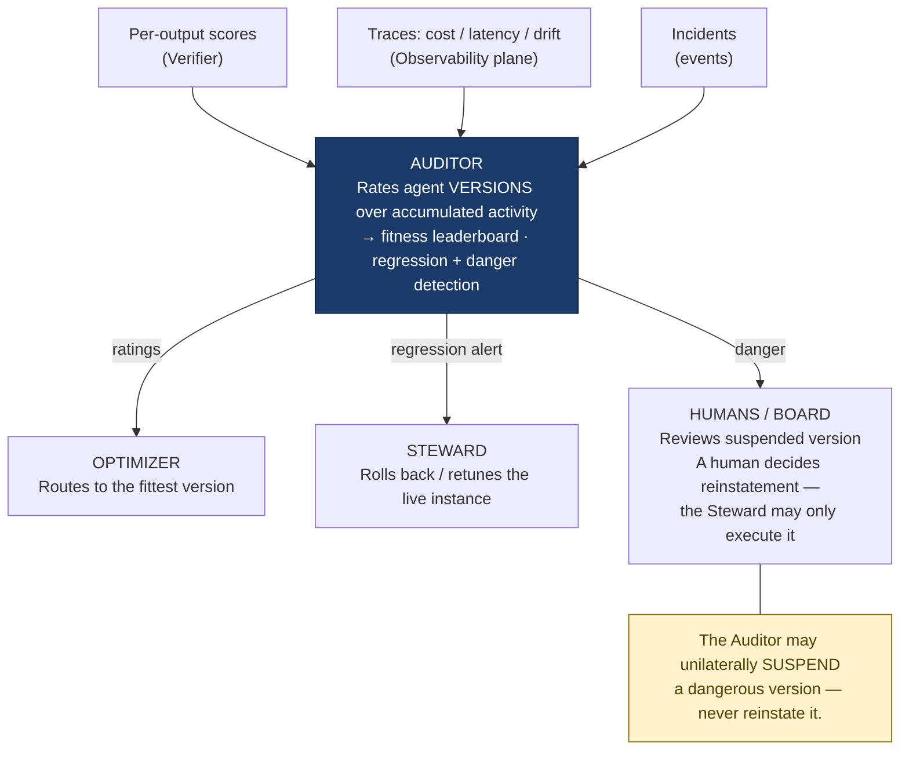
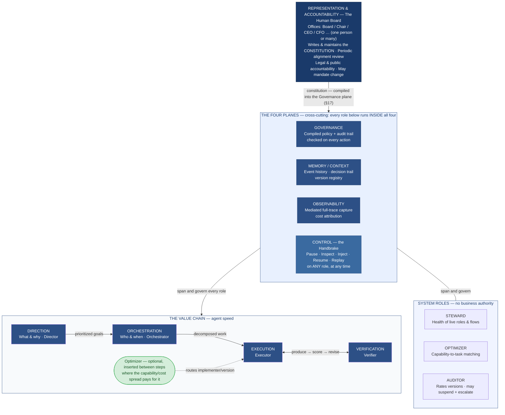
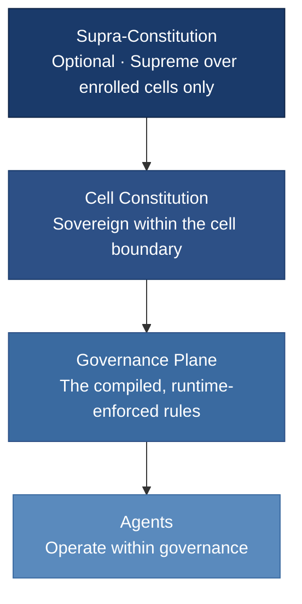
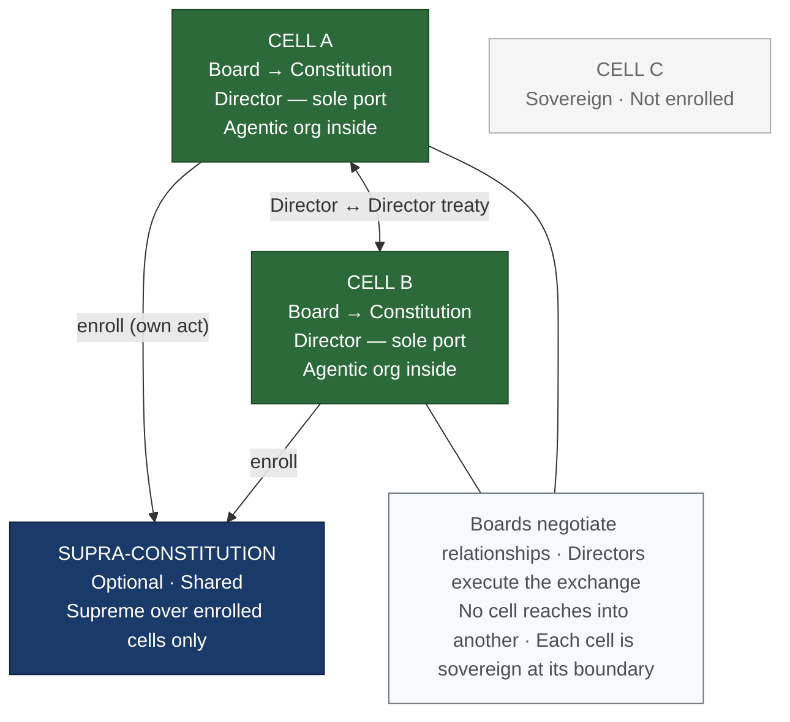
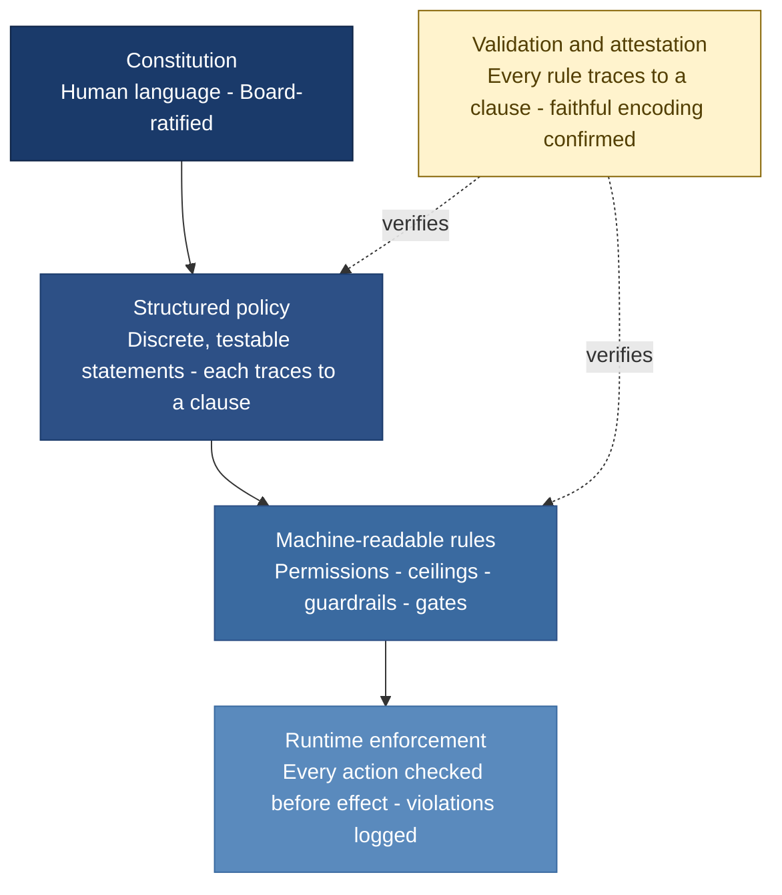
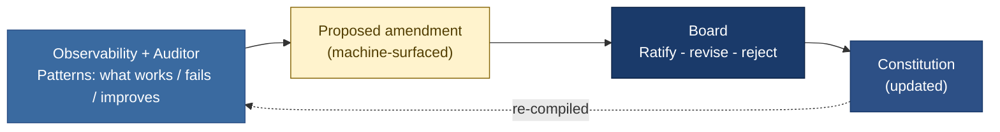
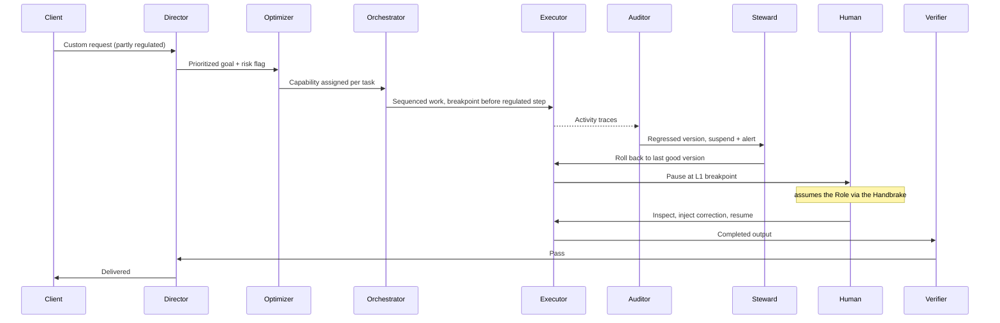
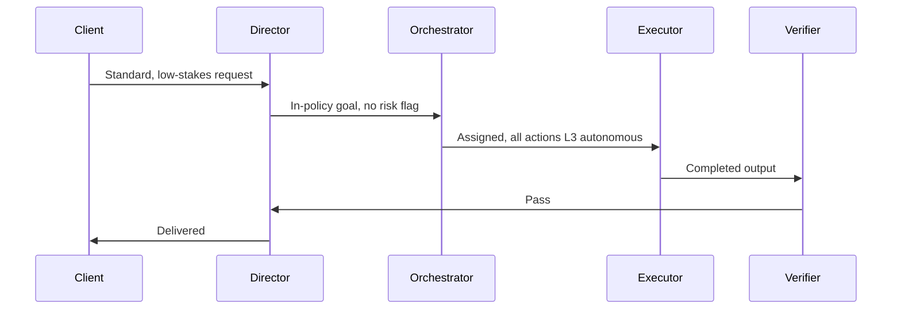
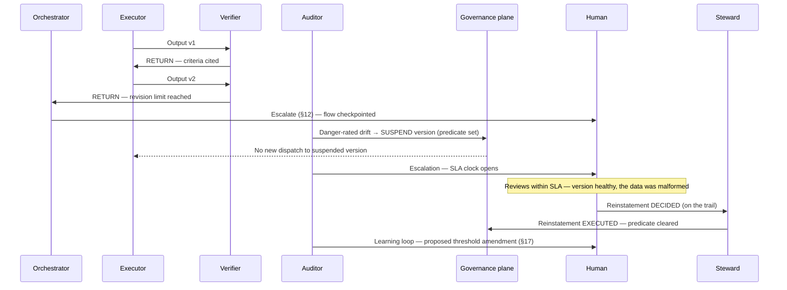

# The Agent-Native Enterprise

**A reference operating model for organizations where any role can be filled by a human or an agent, every process is built for agents first, and every flow can be paused, adjusted by a human, and resumed.**

This is a generic model. It is inspired by software delivery but is not specific to it; the same structure applies to any goal-pursuing organization (operations, services, research, manufacturing coordination, back-office).

Two properties define it and separate it from a conventional org chart with chatbots bolted on:

1. **Role polymorphism** — a role is a contract, not a person. An agent, a human, or a deterministic program can implement the same contract interchangeably (how far interchangeability stretches at high throughput is stated precisely in invariant #2 and §7).
2. **Universal interruptibility** — every autonomous flow is built with a handbrake. A human with AI skill can stop it, inspect its state, inject an adjustment, and resume — by design, on every flow, not as an exception.

**Humans do not disappear from the top of this model.** They move to where human judgment and human accountability are irreplaceable. Above the agentic organization sits a human **Representation & Accountability layer** — the *Board* — the people who set the organization's purpose and boundaries, carry its legal and public responsibility, and answer for it in the human world. They are not removed; they are relocated *out* of the millisecond decision loop, where human latency would only be a bottleneck, and *into* the part of the structure only humans can hold. Crucially, this layer is a **pattern, not a headcount**: the Board may be a hundred people, ten, or a single founder. A one-person company and a large enterprise run the identical model — only the size of the human layer differs. Existing leadership structures map onto this layer intact; what changes is that they stop being the operational bottleneck. (See §3.)

**The model is not limited to new organizations.** Its unit is a self-contained, sovereign **cell** — which can be an entire company *or* a single bounded zone running in parallel inside an existing organization, staffed by people who already work there. Many cells compose into a federation without changing the pattern. (See §16.)

## In one paragraph

*One model, one rule of thumb: humans hold the Offices and write the constitution; agents fill the Roles and run the work; system roles keep the machine healthy (Steward), efficient (Optimizer), and trustworthy across versions (Auditor); any flow can be stopped, corrected by hand, and resumed; and a human can become any Role at any moment — bound, like every agent, by the constitution they set.*

## Contents

§1 Design invariants · §2 The role as an interface · §3 The Representation & Accountability layer · §4 Operating and system roles · §5 The planes · §6 The Handbrake · §7 Agent-first, human-tolerant execution · §8 Authority and autonomy · §9 The Steward · §10 The Optimizer · §11 The Auditor · §12 Escalation and human takeover · §13 Reference topology · §14 Failure modes, guardrails, and trust boundaries · §15 Adoption sequence · §16 Cells, sovereignty, and federation · §17 Constitutional mechanics · §18 Worked examples · §19 Related work — Appendix A: the seven role contracts · Appendix B: a minimal handoff vocabulary · Appendix C: conformance profiles and checklist · Appendix D: glossary

## How to read this document

**Conformance language.** Statements written with **must / never / is required** are binding: an implementation that lacks them does not conform. Statements with **should / recommended** are strong defaults, deviated from only with recorded rationale. Statements with **may / optional** are choices. The eleven invariants are cited as **INV-1…INV-11** (interchangeably, "invariant #n") and the §6 handbrake requirements as **HB-1…HB-4**. §13's diagram, §18's examples, §19, and Appendices B and D are informative; everything else is normative. Where the model deliberately leaves a value to each organization it says *declared in the constitution* — that is delegation, not an unspecified gap. Appendix C turns the binding statements into a checkable conformance list.

**Maturity.** §1–§15 and §17–§18 are implemented at least once by the reference cell (see the note at the end). §16's federation layer — treaties, the supra-constitution — is design-stage: not yet exercised by any two-cell deployment, and honestly labeled speculative until it is.

---

## 1. Design invariants

These are the non-negotiable rules, cited throughout as INV-1…INV-11. Everything below is a consequence of them.

1. **Depend on the contract, not the implementer.** No part of the system may assume a role is held by an agent or by a human. It depends only on the role's declared inputs, outputs, authority, and guarantees.
2. **Agent-first, human-tolerant.** Default execution runs at agent speed. Every role can be *stopped, inspected, and corrected* by a human at any time; a role whose declared throughput is human-boundable can additionally be *run* by one, and a role that is not must declare suspension-plus-inspection as its human-takeover mode in its contract (§2, §7). Either way, the surrounding system must continue functioning at degraded speed without cascading failure.
3. **Every flow has a handbrake.** Interruptibility is core architecture, not a feature. A flow that cannot be paused, inspected, adjusted, and resumed is non-compliant.
4. **Side-effecting actions are made as safe to retry as the effect allows.** Where an effect is yours or reversible, it is idempotent — retry or resume never duplicates it. Where it is irreversible and owned by a non-idempotent outsider (you cannot un-send a message or un-ship a unit), the guarantee narrows to at-most-once *attempts* plus compensation where reversal exists. The outside world is never assumed idempotent; safety is engineered on the side you control.
5. **State lives outside the actor.** Context, progress, and history are held in shared, durable storage — not inside the agent's transient memory or a human's head — so any implementer can take over a role mid-flow.
6. **Authority is graduated and explicit.** Every action class has a declared autonomy level. Blast radius determines how much human gating it requires.
7. **One abstraction per layer.** A layer never reaches across levels. The top layer does not know about individual tool calls; a worker does not know the global strategy. This is what keeps the system debuggable.
8. **Add hierarchy only when complexity forces it.** Most designs overshoot by one tier. Start with the fewest layers that solve the problem.
9. **Office ≠ Role.** A human holds an *Office* (accountability and representation in the human world); an agent fills a *Role* (operations in the agentic org). They are not one-to-one. The corollary is the **two-channel rule**: humans affect the agentic org through exactly two channels — the constitution (authoring and amending it, *and exercising the gate-powers it explicitly grants to humans*: an L1 approval, an L0 execution, a break-glass act — §8, §17), and impersonation of a Role — and nothing else. A gate-power is narrow, momentary, and enumerated; impersonation is open-ended holding of a Role's seat under the Role's authority. One invariant, two faces: the distinction says what a human *is* to the org; the corollary says how a human *reaches* it.
10. **Governance is the compiled constitution — its rule-shaped part.** The Governance plane encodes the *projection* of the constitution that reduces to rules: authority ceilings, permissions, budget caps, required gates. The purposive core — whether the org still serves human interest — does not compile and stays in human Board review (§3). Every encoded constraint traces back to a written human mandate; agents never author their own constraints. The plane enforces the mechanical fraction; human judgment carries the substantive remainder.
11. **A cell is sovereign at its boundary.** A cell is an organization in itself. Nothing outside it — a parent organization or a sibling cell included — may affect it except through its own constitution or an authorized Role, exactly as inside. The boundary obeys the same law as the interior.

---

## 2. Core abstraction: the role as an interface

A **role** is a declared contract with this shape:

| Field | Meaning |
|---|---|
| **Responsibility** | The single outcome this role owns. |
| **Inputs** | What it consumes, and from which roles. |
| **Outputs** | What it produces, and to which roles. |
| **Authority scope** | What it may decide and act on alone; what it must escalate. |
| **Acceptance criteria** | How "done" and "correct" are judged. |
| **Escalation rule** | The conditions under which it must hand off to a human or a higher role. |
| **Observability hooks** | The traces, costs, and signals it must emit. |

An **implementer** — agent, human, or deterministic program — satisfies the contract. The system binds to the contract. This makes "a human jumps into the role" a runtime substitution, not a redesign. It is the same principle as an interface with interchangeable implementations: the caller is unaffected by which one is running. The contract is given here as *fields and guarantees*, deliberately not as any particular file format or schema language: the model specifies what a role must declare, never how to write it down. That omission is intentional — it keeps the model independent of any toolchain and any era of tooling. A contract also declares its **human-takeover mode** — *run* (a human can hold the seat at its working throughput) or *suspend-and-inspect* (a human stops, inspects, and corrects it, but cannot run it live) — per INV-2 and §7. Appendix A instantiates this contract shape for all seven roles.

**Who writes the acceptance criteria.** Criteria are authored by the role that *issues* the work — Direction sets them when it specifies a goal (turning demand into well-specified direction is that role's one job, §4.1), and each decomposition inherits or refines them downward. Two roles are barred from authoring them: the Executor (the producer cannot write its own bar) and the Verifier (the gate cannot either — it scores against criteria it did not set, which is what keeps the checker's independence real). Every criterion must be *checkable* — a statement the Verifier can score as met or unmet, not an aspiration — and *mechanically* checkable where possible (a test, a schema, a policy predicate): judgment-graded criteria are permitted, but they inherit the machine-judge reliability caveat of §4.4. When the Verifier finds a criterion untestable or ambiguous — or a goal whose framing contradicts the constitution or its own stated premises — it does not interpret silently: it returns the goal to Direction as an escalation, the same way it returns a failing output. Ambiguity is forced back to the role paid to resolve it, never absorbed by the role paid to judge.

**Human impersonation on demand** is the default mode for substitution: every role runs as an agent unless and until a human assumes it for a specific need (a hard decision, a novel situation, a correction, an audit), then hands it back.

---

## 3. The Representation & Accountability layer (the human Board)

The agentic organization needs a human anchor in the human world — something an agent cannot be. An agent cannot hold legal accountability, sign a binding commitment, face a regulator, or stand as the responsible human face of the entity. Conventional organizations fuse this representation with day-to-day operational decisioning. This model **splits them**:

- **Accountability and representation** → human, deliberately *outside the hot path*, operating at human-world cadence.
- **Operational decisioning** → agentic, *inside the hot path*, at agent speed.

The reason is simply speed: a human permanently in the decision loop becomes the bottleneck the entire system must slow down to. So the humans sit above the loop and reach into it only on purpose.

### The Board is a pattern, not a group
The Board may be a hundred people, ten, or one. A single-founder company runs a Board of one; a large enterprise runs a large one. The responsibilities below are identical at every size — only the headcount changes. Existing executive and governance structures fit here unchanged; they simply stop being the operational throughput limit.

### Isn't the Board just the management layer, smuggled back in?
A fair objection, given the model folds CEO, Product Owner, and Project Manager into one agentic Director: if agents absorb the coordination layer, why does a human layer reappear on top? Because the Board does the one thing an agent *structurally* cannot — it holds legal accountability and authors the constitution. "Management" in the sense the model removes is *operational coordination*: deciding who does what and when, reconciling the moment-to-moment — exactly what the Director and Orchestrator absorb. What the Board keeps is not coordination but *answerability and purpose-setting*: being the human the law and the public hold responsible, and writing the goals the system pursues. Those do not get more efficient at agent speed; they require a human because their value is accountability, not throughput. The Board is not the management layer returning — it is the residue left once coordination is automated away. "Residue" understates one thing, so it is stated here rather than discovered later: the Board also keeps the organization's *outward-facing* work — market sensemaking, capital, partnerships, the external relationships whose value is human trust — human-held for the same reason accountability is: their currency is trust, not throughput. Where relationship capital is the product, this function is large, and the Board should treat it as a duty, not a leftover.

### What the Board does (levers only — never hands-on operation)
1. **Authors the constitution** — the organization's purpose, values, goals, and behavioral boundaries. This is the source document the top agents operate under.
2. **Maintains and amends it** — the constitution is living; the Board owns its changes.
3. **Runs periodic human-interest alignment review** — checks that the agentic org still serves the human purpose it was built for, and has not drifted into doing something technically flawless but wrong. The test is concrete: divergence from the *written* purpose is drift, to be corrected; a deliberate, ratified change to that purpose is evolution, a constitutional amendment. The Board measures behavior against the text, not against a mood. The review's power is bounded by the independence of its evidence: a review fed solely by the cell's own telemetry is non-compliant — at least one channel the reviewed system cannot shape is required (Board-chosen raw-trace sampling from the tamper-evident event plane, direct stakeholder contact, or an external audit) — and cadence and sample size are declared in the constitution against the cell's action volume. The constitution also declares a ceiling on the interval (or action volume) between Board spot-reviews of Direction's goal-framing, so "periodic" bounds how long a mis-framed goal can run unexamined (§4.1).
4. **Holds binding authority to mandate modification** — issued as a constitutional amendment or a formal change request, never as turn-by-turn meddling.
5. **Carries legal and representational accountability** — answers for the entity in the human world.
6. **Owns succession** — of Board members and of the standby humans who can competently impersonate each critical Role (§12). The model's safety valve is a human bench that decays without deliberate regeneration (§7); keeping it staffed and practiced is a Board duty, not an assumption.

### How the Board itself decides
The model governs the Board the way it governs everything else: by writing it down. A Board of one needs no procedure; any larger Board must declare its *own* decision rules **in the constitution** — quorum, the threshold to ratify or amend, how internal disputes resolve, and what happens on deadlock. This is the model's self-referential closure: the constitution governs its own amendment process, so "how the Board decides" is never improvised at the moment it matters most. The model requires only that these rules exist and are written; it does not prescribe their content — a founder may keep sole authority, a council may require supermajority — that is the organization's choice.

### Constitution → governance pipeline
The Board writes the **constitution** (human language, human intent). It is compiled into the machine-readable **Governance plane** (§5), which the top agents read and obey at runtime. This is the same shape as constitution → law → regulation: human principle becomes enforceable runtime constraint. It is also why invariant #10 holds — agents never write their own rules.

### Office ≠ Role
A human holds an **Office** — Board member, Chair, CEO, CFO — a human-world title carrying accountability and representation. An agent fills a **Role** — Director, Orchestrator, Executor, Verifier, Steward, Optimizer, Auditor — an operational seat in the agentic org. **They are distinct and not one-to-one.** "CEO" is an Office; "Director" is the Role that owns top-level operational direction. The human CEO does not *run* the org turn by turn; the Director agent does.

### The impersonation-binding rule
When a Board member impersonates a Role — say, steps into the Director seat through the handbrake — **they act as that Role**: they inherit the Director's authority scope and are bound by the same Governance plane as the agent would be. They do **not** carry their Office authority into the seat. A human cannot enter a Role and act outside the constitution "because they are really the CEO." Doing something the governance forbids is not a keyboard action — it is a **constitutional amendment**, which is slow, deliberate, and audited. The handbrake lets humans operate *within* policy; only the Board, acting as the Board, changes policy. Two powers, two speeds, two separate audit trails.

### Board review vs. Steward monitoring vs. Auditor rating (don't confuse them)
- The **Steward** (§9) watches *operational/behavioral* drift of a live instance: is the agent following the written rules and working correctly right now — continuous, technical, agent-speed.
- The **Auditor** (§11) rates *versions* over accumulated activity: is this release better, worse, or more dangerous than the last — continuous, evaluative, agent-speed.
- The **Board** watches *purpose* drift: are the rules still the right rules, is the org still serving human interest — periodic, judgment-based, human-speed.

The Steward catches "the Director instance is malfunctioning." The Auditor catches "Director v5 regressed against v4." The Board catches "the Director is flawlessly executing the wrong mission." None can do the others' jobs.

### The one Board failure mode to guard against
The Board must not slide into **shadow operation**. The moment it makes continuous turn-by-turn calls, it reintroduces the human bottleneck it exists to eliminate. Its influence flows through the constitution and through bounded Role-impersonation — not through meddling.

---

## 4. Operating and system roles

Roles divide into two kinds. **Operating roles** form the value chain — they turn intent into delivered outcomes. **System roles** own no business outcome; they keep the machine itself healthy, efficient, and trustworthy. Each role lists a suggested human-readable holder name; the generic noun is the role, the name in parentheses is what a reader can picture a "person" being called. Roles are *logical contracts*, not necessarily separate systems: two roles may run on one underlying implementation with different permissions. What separates them is authority and the object they act on, not the process that runs them — with one caveat the trust boundaries (§14) make explicit: sharing an implementation separates *authority*, never failure modes, so a checking role should not share a single point of provenance with what it checks on high-blast-radius classes (§4.4, §10).

### Operating roles

#### 4.1 Direction *(holder: Director)* — consolidates CEO + Product Owner + Project Manager
Owns **what and why**. Takes intent from stakeholders or clients, converts it into a prioritized backlog of goals with constraints and acceptance criteria, operating under the constitution. Highest operational decision authority. The three legacy roles collapse here on a stated bet: *to the extent* execution and coordination are competently agent-driven, the residual human-scarce input is clarity of intent — one job: turn demand into prioritized, well-specified direction. It is named as a bet because the measured evidence still cuts the other way for current-generation systems — inter-agent coordination failures remain a leading empirical failure class (§19: MAST) — which is exactly why Orchestration stays its own role, the Steward watches it hardest, and §14 keeps "supervisor as single point of failure" on the books. At large scale this role can concentrate too much; the answer is not to bloat the Director but to **split the cell** (§16) or, within INV-8, to tier Direction (portfolio-level over cell-level) — decompose only when the load actually demands it. Concentration is also a *framing* risk, not only a load risk: the Director authors both the goals and their acceptance criteria, so a mis-framed goal sails through every downstream gate while the Board's catch is periodic. Three cheap counters exist: the Verifier's premise-bounce (§2), the constitution-declared ceiling on the Board's spot-review interval (§3), and — for high-stakes goals — a **divergent-framing check**: a second Direction variant (or a human) frames the goal independently, and disagreement escalates (§12).

#### 4.2 Orchestration *(holder: Orchestrator)*
Owns **who does what, and when**. Decomposes each goal into work, routes it to Executors, sequences dependencies, handles exceptions, and decides whether to retry, escalate, or proceed. The supervisor layer. It does not do the work and does not set strategy.

#### 4.3 Execution *(holder: Executor, a.k.a. Specialist)*
Owns **how**. Specialist implementers that produce the actual work product. Narrow, deep, replaceable. An Executor knows its task and its tools, not the global plan.

#### 4.4 Verification *(holder: Verifier, a.k.a. Reviewer)*
Owns **is it correct and within policy**. Independently scores outputs against acceptance criteria, quality, safety, and conformance before they take effect. Runs as an evaluator loop against Execution: produce → score → revise. Independence from Execution is the point — the checker is not the producer. Role independence is not *statistical* independence, though: an Executor and a Verifier built on the same or a similar base model share blind spots, and machine judges measurably favor outputs of their own lineage (§19). For high-blast-radius classes the constitution should require the Verifier seat to be **implementation-independent** of Execution — a different model family, or best of all a deterministic checker. Where acceptance criteria are mechanically checkable, a deterministic program is the *preferred* Verifier: its independence is established by construction rather than monitored, it cannot be prompt-injected, and it is the cheapest implementer available — role polymorphism working as designed (§2), not an exception to it.

The gate's three outcomes are defined: **pass** — the output may take effect; **return** — revise against cited criteria, bounded by a revision limit declared in the constitution, after which the flow escalates per §12 (an unbounded produce→score→revise loop is optimization pressure against the gate — reward hacking needs no compromise, only iterations); **block** — a policy or boundary violation, a binding stop, logged with the cited clause. A per-criterion *unclear* score triggers §2's ambiguity rule: returned to Direction, never interpreted silently. Like any role, Verification may decompose at scale into distinct correctness, compliance, and risk checks — but only when complexity forces it (INV-8); by default it is one gate, and policy/compliance is enforced cross-cuttingly by the Governance plane rather than bolted onto Verification.

### System roles *(non-authoritative — they optimize the machine, not the business)*

#### 4.5 Steward *(holder: Steward)* — the renamed "org doctor"
Owns **are the role-holders themselves healthy and behaving normally**. Monitors, maintains, tunes, and repairs the other roles — especially the high-authority Direction and Orchestration agents. Full technical capability over them, **zero business-decision authority**. Detailed in §9.

#### 4.6 Optimization *(holder: Optimizer)*
Owns **is each task handled by the right-capability implementer**. Sits optionally between steps and decides which model/implementer a given task requires, bounded by the task's risk and quality floor. Detailed in §10.

#### 4.7 Audit *(holder: Auditor)*
Owns **how versions of agents compare over time** — whether a given version is better, worse, or more dangerous than another, and which release is currently fit. Continuously rates agent versions from their accumulated activity; normally only monitors and reports. May **suspend** a dangerous or severely drifting version and escalate to humans, but cannot modify, dismiss, restart, or reinstate. Detailed in §11.

| Kind | Role | Holder | Owns | Authority |
|---|---|---|---|---|
| Operating | Direction | Director | What & why | Highest (within constitution) |
| Operating | Orchestration | Orchestrator | Who/when | Routing, retry, escalate |
| Operating | Execution | Executor | How | Within-task only |
| Operating | Verification | Verifier | Correctness/conformance | Gate: pass / return / block |
| System | Steward | Steward | Health of live role-holders | Technical only, **no business decisions** |
| System | Optimization | Optimizer | Capability-to-task fit | Selection only, **no business decisions** |
| System | Audit | Auditor | Fitness & safety of versions | Monitor/report; may suspend + escalate; **no modify, dismiss, or reinstate** |

Every role: agent by default, human impersonation on demand — and a deterministic program wherever the contract is machine-checkable (§4.4).

---

## 5. The planes

Roles run *inside* four cross-cutting planes. Planes are shared infrastructure every role depends on.

- **Governance plane** — the machine-readable, runtime-enforced encoding of the Board's constitution (§3): authority limits, guardrails, constraints, and an append-only audit trail. Policy is data the agents read at runtime, not documentation humans read later. Nothing acts outside it.
- **Memory / context plane** — durable shared state: the current state of every goal, an append-only event history of decisions and actions, the artifacts produced, and a **version registry** that identifies every agent version and parallel variant and attributes activity to it (without which the Auditor cannot compare versions). A *version* here is the whole behavioral bundle — logic, prompts, weights, configuration — not merely code; and a human takeover or handbrake adjustment **opens a tracked variant** (a variant_of the incumbent version) for the duration of human control, closed on hand-back — never an untracked change — so the registry stays the source of truth, a version's scorecard measures the release rather than a human quietly rescuing it, and human interventions are separately attributable. Stated as fields and guarantees (like the role contract, §2 — never a schema language): a registry entry declares *identity* (role, version id — and, where the implementer is a hosted model, the pinned upstream model snapshot, or provider-side updates silently change the behavioral bundle mid-rating), *lineage* (what it derives from — predecessor or the variant_of link for a tracked variant), *status* over a declared lifecycle (at minimum: **probationary**, active, rolled back, suspended — a new version enters probationary and *earns* active under §11's evidence rule, and rolled-back-by-Steward and suspended-by-Auditor stay distinct, attributable acts), and *activation time*; and every recorded act carries **who acted** — role, version, and *mode* (agent, human, or program), plus the Office when a human acts in Board capacity — because impersonation-binding (§3) and separation of record (§16) are enforceable only if the capacity is recorded per act. A per-version scorecard (runs, pass rate, attributed cost) is then derivable from the event history rather than separately maintained. This is what lets a flow pause on Friday and resume on Monday, and what lets a human take over a role with full context. For a takeover to be more than picking up raw state, this history must capture the *decision trail* — what was decided and why, not only what changed — so whoever inherits the role inherits the reasoning, not just the outcome. Legible reasoning, not merely stored state, is what makes a clean handover possible. Two guarantees keep the trail trustworthy. **Provenance:** stored reasoning is *trusted* by whoever inherits it, so entries and summary spans derived from untrusted external content stay labeled as such, and a resumed flow — or a human reading a briefing — applies the same data-not-instructions posture to replayed history as to fresh tool output; without this, the memory plane launders an injection into trusted state (§14). **Decisions are consumed, never re-made:** any decision that shaped a run — the Optimizer's routing choice included, not only human injections — is recorded in the event history and reused on resume, or the replay guarantee of §6 silently breaks.
- **Observability plane** — full-trace capture of every step, tool call, decision, cost, and output for every role. Not event logging — session-level trajectories. The raw signal the Steward, Optimizer, Auditor, and Verification consume. Capture is **mediated, not volunteered**: traces are recorded by the plane at the runtime and tool-call boundary — the substrate the role runs on, not the role's own code — and a role's self-emitted signals are claims to be cross-checked against mediated capture. Any signal consumed for an authority-relevant decision (a suspension, a rollback, an autonomy raise) must come from a source the measured role cannot write; an assurance stack fed by the self-reports of the parties it measures is not an assurance stack.
- **Control plane (the Handbrake)** — the human-with-AI-skill interface for pausing, inspecting, adjusting, and resuming any flow. Detailed below; it is the architectural centerpiece.

**Data governance across the planes.** Full-trace capture will contain client data, secrets, and personal data, so the planes carry it as governed content — stated, as ever, as guarantees: events and artifacts carry a **classification**; a role contract's *Inputs* bound what that role — and any human impersonating it — may read from the planes (least privilege applies to plane reads, not only to tool access); the constitution declares **retention and erasure** policy, and erasability must coexist with tamper-evidence (payloads erasable, integrity chain preserved — mechanism open); and data leaving the cell to an external implementer or model provider is an outbound boundary crossing, governed like any other external effect (§8).

---

## 6. The Handbrake (control plane in depth)

The handbrake is the debugging mode of the enterprise. The analogy is exact: a car has a maintenance/debug mode where a technician halts normal operation, inspects and tunes internals, then returns the car to normal mode. The same must be true of every flow in the organization.

It is built from five primitives that already exist as engineering patterns — checkpointing, breakpoints, and record-replay are proven as-is (this is the durable-execution pattern, §19); mid-flow injection into agent state is the same patterns applied to a newer substrate:

1. **Breakpoints** — declared pause points, set *before* or *after* any step. Some are static (always pause here — e.g. before an irreversible action); some are dynamic (pause only when a condition or confidence threshold is met).
2. **State inspection** — at a breakpoint, the full state is readable: what has been done, what was decided and why, what it cost, and exactly where it paused. A human taking over should receive this as a readable briefing — a summary of recent activity and the exact decision point — not raw state alone; the handbrake is only as useful as the human's ability to understand what they are looking at.
3. **Injection** — the human does not just approve or reject. They can supply an edited output, missing context, a corrected decision, or a direct CLI/prompt-level instruction that overrides what the agent was about to do.
4. **Resume** — the flow continues from the exact paused point, consuming the injected value instead of re-deciding. It does not restart from the top.
5. **Replay** — any past run can be reconstructed step by step *from the recorded trail* — inputs, outputs, and the decision trail (§5) — to find where a bad decision entered ("time-travel debugging" in the record-replay sense). Replay is reconstruction, not re-execution: an LLM step is not reproducible in general (inference is nondeterministic; provider-side updates silently change the function being called), which is exactly why the version registry pins the behavioral bundle and the trail must capture *why*, not only *what*.

**Hard requirements that make the handbrake real (HB-1…HB-4):**

- **HB-1.** A **durable checkpointer** must persist exact state at every meaningful step, or pause/resume is impossible.
- **HB-2.** Every tool/action must be **as safe to retry as its effect allows** (INV-4): idempotent where the effect is owned or reversible; an at-most-once *attempt* with a recorded outcome — plus compensation where reversal exists — where it is not. Resume never re-fires an effect whose prior attempt is recorded, and never skips one that did not happen.
- **HB-3.** The handbrake must be present on **every** flow as a structural property, callable by any authorized human at any time — not a special path some flows happen to support. And *authorized* is a governed word, not a vibe: handbrake access presupposes authenticated, attributable human identity (§14, trust boundaries); the authorized-humans list is Governance-plane data, scoped per role and autonomy level; changes to that list — and to the break-glass roster (§17) — are high-blast-radius acts under §8; and every injection is attributed to a named human in its own audit trail.
- **HB-4.** **Re-entry is resume, not restart.** Re-entering a flow after implementer death behaves like resume: a completed flow idempotently returns its recorded outcome with no new events; a crashed one continues from its last durable step; recorded decisions are consumed, never re-made (§5).

This is what makes "a human jumps in, adjusts, then steps back out" a first-class operation rather than an emergency.

---

## 7. Agent-first, human-tolerant execution

Processes run at agent latency by default. The hard problem is graceful degradation when a human assumes a role: a human is a slow node, and the system must absorb that without stalling.

Mechanisms:

- **Asynchronous, event-driven coordination.** Roles communicate through durable messages and events, not blocking calls. A waiting human holds up only the work that genuinely depends on their output.
- **Durable pause/resume.** A flow waiting on a human is a paused, checkpointed flow — not a thread burning resources. It can wait minutes or days at no cost.
- **Buffering and backpressure.** Upstream roles keep producing into queues; downstream flow control prevents a slow human node from cascading stalls through the system.
- **Elastic SLAs.** Service expectations flex by implementer mode. A goal's deadline accounts for whether a role is currently agent-held or human-held.
- **Reroute where possible.** Independent work continues around the human node; only dependent work waits.

The principle holds cleanly for bounded, low-fan-out roles: a human there changes the *speed* of one node, not the *correctness* of the system. It is not universal. For a high-throughput agent role — an Orchestrator fanning out thousands of parallel tasks — a long human pause eventually saturates the buffers, and backpressure then reduces the *liveness* of the dependent subtree. So polymorphism guarantees a human can always *stop and inspect* any role; it does not guarantee a human can *run* one at its native throughput. The honest rule is takeover where the role is bounded, and suspension where it is not (INV-2; the mode is declared per contract, §2).

There is a second honest cost, managed rather than denied: moving humans out of the loop for throughput degrades their readiness to intervene — the ironies of automation (§19) — and the model's own success erodes the practice that keeps its safety valve competent. Takeover competence is therefore a *maintained* resource, not an assumption: the constitution declares per-role takeover drills on live or replayed flows (the Replay primitive is a ready-made simulator), and time-to-competent-intervention is an observable the Steward reports and the Board reviews (§3, §12).

### Why the gates don't slow it down
A reasonable worry is that a Board, a Governance plane, an Auditor, and a Verifier add up to gridlock. They do not, because the human-speed functions sit *outside the hot path*: the Board is constitutional and periodic, never in the loop; the Auditor normally only monitors, asynchronously; Governance is compiled runtime checks, not meetings; and the only *always*-inline gate, Verification, runs at agent speed (L0/L1 breakpoints are also inline, by design — but only for high-blast-radius action classes). The model multiplies *governance concepts*, not *synchronous human approvals* — which is exactly what lets it stay faster than a management hierarchy while being better governed. To keep it that way, gates are reviewed periodically and any that no longer earn their place are retired — governance is pruned, not only added, so checks cannot quietly accumulate back into the hot path. Gate *health* is monitored the same way: an L1 gate whose approval rate saturates near 100% is either dead weight or a rubber stamp — approval fatigue is a measured effect, not a hypothetical — and either way it is redesigned, not left to decay.

---

## 8. Authority and autonomy model

Every action class carries a declared autonomy level. Blast radius — the size and reversibility of consequences — sets the ceiling.

Blast radius is two axes, not a feeling: **reach** (who is affected if this goes wrong) and **reversibility** (what undoing costs). The class takes the *worse* of the two — a trivially wide action and an irreversible narrow one are both high-blast — and when the two are in doubt, round up; that is the same fail-safe posture the novel-action rule below applies to the unclassified.

| | Undo is cheap (minutes, yours) | Undo costs real effort | No undo exists |
|---|---|---|---|
| **Reach: inside the cell** | L3 | L2 | L1 |
| **Reach: other cells / the org** | L2 | L1 | L1 |
| **Reach: outside world (clients, public, regulators)** | L1 | L1 | L0 |

The table is a *default mapping*, not a verdict — a cell's constitution may only tighten it (assign a lower level), never loosen it. It exists so "high blast radius" is an answer to two checkable questions rather than a judgment call made under deadline.

| Level | Behavior | Use for |
|---|---|---|
| **L0 — Suggest** | Proposes; a human acts. | Highest-risk, irreversible actions. |
| **L1 — Act with approval** | Prepares the action; pauses at a breakpoint for human approval before it takes effect. | High blast radius, reversible with effort. |
| **L2 — Act and report** | Acts within policy, then reports for after-the-fact review. | Routine, low blast radius. |
| **L3 — Fully autonomous** | Acts within policy, no per-action review; subject to monitoring. | Well-understood, low-stakes, high-volume. |

Rules: autonomy is assigned **per action class, not per role**; the same role may operate at L3 for safe actions and L0 for dangerous ones. Autonomy is raised over time as trust is earned from observed performance, never granted by default — but because raising an action class *is* a change to enforced governance, an agent never raises its own. The Observability plane and the Auditor *propose* an increase as a machine-surfaced amendment (the learning loop, §17); a human ratifies it. Performance earns a proposal, not an automatic promotion — the lever is always pulled by a human (invariant #10). Higher autonomy always implies stronger monitoring, not weaker. This model also sets the **capability floor** the Optimizer (§10) must respect. Risk classes are coarse and inherited by default — an action takes the class of the category it belongs to, refined only where blast radius actually varies (invariant #8) — so classification is a small governed set, not a per-action burden across thousands of cases. The hard case is the genuinely novel action — one with no prior class, like the new regulated capability in the worked example (§18). The model's answer there is fail-safe, not fast: an unclassified novel action inherits the *highest* risk class by default (lowest autonomy, human-gated) and at the same time raises a classification proposal to the Board. This is deliberate about a real cost — genuinely novel high-blast-radius work *is* slower the first time, because treating the never-before-done as low-risk to keep up speed is precisely the mistake the model exists to prevent. Once classified, the class is reusable and fast thereafter.

Three refinements close loopholes this model would otherwise leave open:

- **Field evidence has a statistical floor.** Observing zero failures in *n* runs bounds the failure rate only below roughly 3/*n*, so telemetry alone can earn raises for high-volume, low-severity classes — while a class whose feared failure is rare and severe requires complementary evidence (targeted adversarial evaluation, staged canary exposure under a capped blast radius) before a raise is ratified.
- **Deploying a new version into a high-authority role** (Direction, Orchestration) is itself a classified action with a blast-radius level — who may deploy is governed, not implicit — and the new version enters the registry as *probationary* (§5, §11).
- **The humans at L0/L1 gates act through the constitution channel.** Approval and execution are *gate-powers* the constitution explicitly grants to humans (INV-9, §17) — Office-acts on the human side of the boundary, clause-traced and separately audited. A human *executing* an L0 action is not impersonating the Role, whose authority is suggest-only; they exercise a granted power — which is how the impersonation-binding rule and L0 coexist.

---

## 9. The Steward (the "org doctor", named for what it does)

A deliberate check-and-balance: the most autonomous, highest-authority roles (Direction, Orchestration) are the most dangerous if they drift, hallucinate, or degrade. So the model places a **maintenance function over them that can fix them but cannot use their power.**

**Name.** *Steward* (full: **Reliability & Conformance Steward**). Alternatives if you prefer a different flavor: *Homeostat* (keeps the system in equilibrium), *Diagnostician*, *Conformance Warden*, *Org Reliability Engineer*. The chosen name should signal maintenance and health, not command.

**Responsibilities — on two distinct objects, named per act:**
- Watch the behavioral health of the other roles: drift from goals, hallucination, degraded quality, looping, runaway cost, policy violations.
- Contain the running **flow**: quarantine a flow that loops, spirals on cost, or approaches its budget cap, and roll it back to a known-good checkpoint — the continuous enforcement arm of §14's budget and loop guardrails.
- Maintain the live **instance**: adjust configuration and prompts, reset or restart from a known-good checkpoint, and fail over *provisionally* to a registered known-good implementer or version already authorized for the Role (tracked in the registry, auto-flagged for review). *Adopting* a different implementer permanently is the Board/human path of §17, which the Steward cannot take.
- Act on the Auditor's regression alerts (§11): when a version is rated a regression, the Steward is the role that actually rolls it back.
- Quarantine a drifting role-holder and flag for human takeover before it causes harm.

The two objects have different blast radii and different rollback targets — a checkpoint in a flow's history versus a version in the registry — and the record names which breaker fired. The Steward's own writes are graduated like everything else (§8): emergency *containment* — quarantine, rollback to known-good — is unilateral, because pause is safe; *rewrites* of a high-authority role — retuning Direction's prompts or configuration, a provisional failover of Direction or Orchestration — are prepared-and-approved acts (L1, or a two-key rule), because rewriting the Director is the very mechanism by which business behavior is shaped, and "no business decisions" must be enforceable, not aspirational. §14 names Steward compromise accordingly.

**Hard boundary — the Steward may not:**
- Make or change any business decision, priority, or strategy.
- Approve work products or act in place of Verification.
- Override the Governance plane.

It is the difference between the engineer who can restart, tune, and roll back the leadership system, and the executive who decides what the company does. One keeps the machine running correctly; the other decides where the machine goes. The Steward is strictly the former. It governs *operational* drift of *live instances*; *purpose* drift is the Board's job (§3) and *version* fitness is the Auditor's (§11).

**Mode.** Agent by default (continuous monitoring is an agent-scale task), with human impersonation on demand for hard maintenance calls and audits — the same polymorphism as every other role.

---

## 10. The Optimizer (capability-to-task matching)

A non-authoritative system role, sibling to the Steward: the Steward optimizes for **reliability**, the Optimizer for **efficiency and capability-fit**. Neither decides what the org does.

**What it does.** Sits optionally between steps and matches each task to the **minimum-capability implementer that still clears the task's risk and quality floor**. This is not cost-minimization — it is capability-to-task matching, and it sometimes spends *more*. Examples, software and non-software alike:
- Trivial, low-stakes task (update some links; draft a routine acknowledgment) → a light, cheap model.
- Moderate task (add an integration; summarize a contract) → a mid-tier model.
- Novel, high-stakes task (design a new authentication method with access rights; draft and negotiate a binding clause — a human Office executes it, §17) → the strongest model.

**The hard constraint.** The Optimizer is **bounded by the autonomy/governance model (§8)**: the task's risk class sets a capability floor, and the Optimizer may only minimize cost *beneath* that floor. A high-blast-radius task may never be routed to a weak implementer to save money — that is not frugal, it is dangerous. Safety and quality are never traded for cost. Critically, the risk class is **constitutional input, not an Optimizer judgment**: the Optimizer optimizes beneath a floor it does not set. A role that could both classify a task's risk *and* optimize against it could quietly lower the floor to save cost — so classification is governed (§8, §17) and the Optimizer's routing is itself auditable.

**The loop to guard.** There is a subtler way the floor can erode: floors are ratified by the Board, and the Board reads telemetry — much of it produced by the Optimizer itself. If Optimizer output can shape the floor it optimizes against, the role has indirectly authored its own constraint, which is invariant #10 failing in slow motion. The model closes the loop the same way §8 handles autonomy raises: telemetry may *inform* a floor proposal, but a floor change is an amendment — machine-surfaced with its **provenance visible** ("this proposal originates in Optimizer cost data"), ratified by humans who can see the source's incentive, and re-validated at compilation. Data earns a proposal; only a human moves a floor — and never on the unexamined word of the role that profits from the move.

**Where it gets "best version".** When it must pick among versions of an implementer, it consumes the **Auditor's version ratings (§11)** — it does not judge version fitness itself; it routes to the version the Auditor currently rates fittest for the task class. Eligibility, though, is registry **status**, not rating: the Optimizer ranks only among status-active versions, and status changes (a suspension, a rollback) are events consumed before any subsequent dispatch — because ratings are accumulated signals and necessarily lag the breaker (§11).

**Three edges, defined.** When *no* candidate clears the floor, the Optimizer escalates (§12) — it never relaxes a floor to proceed. Before attributed history exists, routing runs on declared nominal capability and cost until the record accrues; a *probationary* version is routed only within its probationary bounds (§5, §11). And the floor may carry a **diversity constraint**: for high-blast-radius classes the constitution may require the Verifier seat to be implementation-independent of Execution (§4.4) — a constraint the Optimizer enforces in routing like any other floor.

**Where to place it (YAGNI).** The Optimizer itself consumes latency and tokens. Insert it only between steps where the cost-or-capability spread is wide enough to pay for the routing decision. A uniform pipeline does not need one — routing it is pure overhead.

**Mode.** Agent by default, human impersonation on demand.

---

## 11. The Auditor (version fitness and safety)

Agents ship in versions, and several versions or parallel variants may run at once — Executor v2 alongside v3, Optimizer v5 under trial. Someone must judge, on the fly and across accumulated activity, whether a version is getting better, getting worse, or becoming dangerous. That is the Auditor. Its human analogue is a **periodic audit team — but run as agents, for agents, continuously.** It does not operate, steward, or direct. It audits, rates, and reports.

**What it judges (the object nothing else owns).** The **version**, evaluated as a population over time. This is distinct from the Verifier, which scores a single *output*, and the Steward, which watches a single *live instance* in real time and can fix it. The Auditor's object is the release itself, judged across many runs.

**Responsibilities:**
- Track every agent version and parallel variant via the version registry (§5).
- Rate versions from accumulated field activity — quality, cost, latency, drift, incident rate — producing a fitness rating / leaderboard per role.
- Detect regressions (a new version performing worse than its predecessor) and dangerous behavior.
- Normally: **monitor and report only.**
- On a dangerous or severely drifting version: **suspend it** (a circuit breaker) and **escalate to humans**.

**Hard boundary — the Auditor may not:**
- Modify, retune, or rewrite an agent — that is the Steward.
- Dismiss or retire a version — that is a human / Board decision.
- **Reinstate** what it suspended — lifting a danger-grade suspension requires a *human decision*, recorded in the audit trail, resolving the escalation; the Steward may *execute* the reinstatement, never decide it. (Ordinary regression alerts are different: there, Steward-autonomous rollback and restore is the designed path.) *Pause is unilateral (safety); un-pause is a human act.* No agent — and no pair of agents — suspends and then quietly un-suspends.
- Make any business decision.

(No burning at the stake: the Auditor can stop a version to prevent harm, but it cannot condemn, alter, or revive one.)

**Why it is not redundant — it closes the evaluation loop.** Two existing system roles silently assume a signal that no role produced: the Optimizer assumes it knows which version is "best," and the Steward assumes it is told when a release regressed. The Auditor is that signal:

**Breaker precedence (deconfliction with the Steward).** Two circuit breakers on two different objects: the **Steward** pauses-to-fix a *live instance* (or a running flow, §9) and may restart it as part of the fix; the **Auditor** suspends-and-escalates a *version* it has no authority to touch. But every live instance runs *some* version, so the axes join — and the join is governed, not hoped away. **What suspension does, mechanically:** it compiles into a Governance-plane predicate, enforced at the action site like any other rule (§17) — no new dispatch to the suspended version, and in-flight actions of that version are blocked at the pre-effect check or checkpointed at the next step. The breaker is enforced by the plane, not by the Steward's reaction time. **Precedence is explicit:** an Auditor suspension outranks a Steward restart for the affected version — the Steward may migrate work to another version; it may not re-activate the suspended one (see the reinstatement rule above). Independent breakers on independent axes, with a defined rule at the one point the axes meet.

**The suspension threshold is governed, not improvised.** Suspension is a heavy act, so the bar is set in the constitution, not left to the Auditor's discretion: it is reserved for *danger* — behavior that risks harm — while ordinary regressions are alert-only, routed to the Steward and Optimizer rather than suspended. To prevent a circuit-breaker cascade, suspensions are rate-limited and one suspension may not auto-trigger others; and because the Auditor cannot reinstate, every suspension carries a **defined human-response SLA** declared in the constitution, so a suspended-but-critical version cannot hang indefinitely waiting on no one. A missed SLA is itself a governed event, not a silent hole: it escalates up the Office ladder and, if still unanswered, onto the break-glass path (§17), so a stuck suspension always surfaces to an accountable human. And if *no* human answers at all, the terminal behavior is defined rather than circular: the suspension holds and the cell degrades to its constitution-declared **safe mode** — new work in the affected class pauses; nothing waits, unbounded, on a human who is not coming.

**Evidence floors, honestly stated.** Below a constitution-declared minimum of accumulated activity a version is rated **unproven** — not judged for fitness — with one deliberate exception: *danger detection is exempt from the evidence threshold*; a safety breach is not an evidence-quantity question. Symmetrically, the Auditor's power is stated honestly: it detects cost, latency, and pass-rate regressions strongly, and rare dangerous tail behavior weakly — the suspension breaker is defense-in-depth, not a reliable dangerous-version detector, which is why §8 demands complementary evidence (adversarial evaluation, capped canaries) exactly where field telemetry is structurally insufficient.

**When to switch it on (invariant #8 / YAGNI).** Only once you actually run multiple versions or parallel variants. With one version per role there is nothing to compare yet — turn it on when versions start flying.

**Mode.** Agent by default, human impersonation on demand.

---

## 12. Escalation and human takeover

A role escalates — pauses and requests a human implementer — when any of these fire:

- Confidence falls below the threshold for its current autonomy level.
- The situation is out-of-distribution: novel, ambiguous, or unspecified.
- The action would exceed the role's authority scope.
- Governance flags a policy boundary.
- The Steward detects drift and quarantines the role, or the Auditor suspends a dangerous version.

Escalation is a clean substitution: the flow checkpoints, a human assumes the role's interface (impersonation on demand), acts or corrects, and either hands the role back to an agent or stays for the duration. Because state lives in the memory plane and the contract is fixed, the takeover requires no special wiring. A human entering a role this way is bound by the same governance as the agent (INV-9, §3). Four rules make the substitution exact:

- **Every escalation runs against a declared response.** The constitution states, per role, the escalation roster and its response SLA — §11's suspension SLA is one instance of this general rule, not an exception — and a missed SLA escalates the same way: up the Office ladder, onto the break-glass path, then the declared safe mode. A paused L1 flow never waits on nobody, indefinitely, by omission. The roster itself is *resourced*: standby duty is rostered, drilled (§7), and compensated as the constitution provides (§17) — a hat with no roster is how takeover fails at 2 a.m.
- **A takeover opens a tracked variant** in the registry for its duration (§5). When the trigger was an Auditor suspension, the human runs as a fresh variant whose lineage names the suspended parent — the suspended version itself never acts.
- **The Auditor's suspend power reaches human-held variants too.** INV-9 means a seat is bound by the Role's constraints regardless of who fills it — with immediate notification to the impersonator's Office; ejecting a human from a seat is exactly as loggable, and exactly as escalated, as suspending an agent.
- **For a role whose contract declares suspend-and-inspect** as its human-takeover mode (§2, INV-2), escalation means: the flow checkpoints, the role suspends, a human inspects and corrects through the handbrake, and an agent implementer resumes — the human corrects the role without pretending to run it.

---

## 13. Reference topology

Humans hold Offices · agents fill Roles · any Role can be impersonated on demand — and every role, operating and system alike, runs inside all four planes (§5); the planes are not stages in the chain.

---

## 14. Failure modes and the guardrails that contain them

Grouped by type. As a rough rule, governance and organizational failures dominate during the transition into the model; operational and safety failures dominate once it runs at scale. The catalog is consistent with — and organized by role against — the empirically measured failure distribution of multi-agent systems (§19: MAST): specification failures land on Direction, inter-agent misalignment on Orchestration, verification failures on the Verifier gate.

**Governance failures**

| Failure mode | Guardrail |
|---|---|
| **Purpose drift** (org flawlessly does the wrong thing) | Board periodic human-interest alignment review (§3); constitution as fixed reference; binding mandate to correct. |
| **Board becomes a shadow operator** (reintroduces the human bottleneck) | Board acts only through the constitution and bounded Role-impersonation, never turn-by-turn; changes are audited amendments. |
| **Constitution is wrong, or in crisis** | Bounded, auto-expiring break-glass for emergencies plus a standing constitutional-review trigger; neither can change the constitution — only buy time until the Board amends it (§17). |
| **Compilation drift** (enforced rules ≠ the written text) | Validation/attestation stage: every encoded rule traces to a constitution clause, re-validated on every amendment (§17). |

**Operational failures**

| Failure mode | Guardrail |
|---|---|
| **Role drift / hallucination** in high-authority agents | Steward monitoring + quarantine; Verification gate; replay for root cause. |
| **Version regression ships undetected** (new release quietly worse) | Auditor rates every version from field activity (§11); regression alerts to the Steward; ratings to the Optimizer. |
| **Cost spiral** (agents loop, burn tokens/compute) | Per-session cost attribution, budget caps, loop detection in the Observability plane. |
| **Supervisor as single point of failure** | Keep Orchestration thin; durable checkpoints so it can be restarted from state; avoid over-centralizing. |
| **Human node stalls the system** | Async coordination, durable pause, buffering and backpressure (§7). |
| **Lost context on takeover** | State in the memory plane, not in the actor; append-only event history. |
| **Governance paralysis** (too many gates) | Human-speed functions kept out of the hot path; only Verification gates inline, at agent speed (§7). |
| **Verifier false-pass** (a bad output clears the only always-inline gate; errors correlated with the producer) | Implementation independence between Executor and Verifier for high-blast classes (§4.4); sampled human re-audit of *passed* outputs, not only failures; Auditor tracks per-Verifier-version escape rates. |
| **Verifier gaming / criteria Goodharting** (the revise loop optimizes against the gate) | Bounded revise loop with escalation (§4.4); rotate or ensemble verification; Steward monitors pass-rate vs. downstream-incident divergence as a drift signal. |
| **Steward compromise** (the maintainer of Direction is subverted or drifts) | Steward rewrites of high-authority roles are L1/two-key; emergency containment stays unilateral (§9); every retune is a registry event; the Auditor rates the Steward like any other role (§17). |
| **A plane goes down** | Governance unreachable → **fail closed**: nothing acts without a rule check (§5). Observability blind past a declared threshold → autonomy ceilings degrade automatically (§8's monitoring precondition no longer holds). Memory-plane loss → halt and restore to the constitution-declared recovery point; the Steward operates recovery, the Board ratifies the posture (§17). |

**Safety failures**

| Failure mode | Guardrail |
|---|---|
| **A dangerous version keeps acting** | Auditor unilateral suspend + immediate human escalation; reinstatement only by Steward or human. |
| **Auditor over-suspends** (availability risk) | Suspension reserved for dangerous or severe drift, not minor regressions; immediate escalation; fast reinstatement path via Steward/human. |
| **Ungoverned autonomy** (local optimization that hurts the whole) | Machine-readable Governance plane every role must read at runtime; graduated authority. |
| **Quality traded for cost** (Optimizer under-provisions a risky task) | Capability floor set by risk class (§8); Optimizer may only optimize beneath the floor. |
| **Goal hijacking / prompt injection** (untrusted input steering an agent) | Contained, not prevented — no current model reliably treats data as data (see trust boundaries): least-privilege tool access; §8 autonomy ceilings (an injected agent still cannot exceed its class); the governance check on every effect; human gates on irreversible actions; provenance labels on stored state so an injection cannot launder itself into trusted history (§5). |

**Organizational & federation failures**

| Failure mode | Guardrail |
|---|---|
| **Over-hierarchization** | Invariant #8 — add a tier only when complexity forces it. |
| **Sovereignty breach** (a parent org or sibling cell reaches inside a cell) | Boundary law (invariant #11): a cell is reachable only through its own constitution or an authorized Role — no interior access from outside, regardless of org hierarchy. |
| **Treaty overreach** (a Director exceeds the inter-cell contract) | Inter-cell contracts declare explicit limits ratified by both Boards; a Director may not exceed what its own Board granted; out-of-envelope matters escalate Board to Board. |
| **Supra-constitution creep** (shared layer expands into micromanagement) | The supra-constitution binds only the matters it explicitly addresses and only enrolled cells; cells stay sovereign on everything left unsaid. |

**Adoption failures** (the transition's own failure class — see §15's kill criteria)

| Failure mode | Guardrail |
|---|---|
| **Sponsor loss** (the Board hat-wearer leaves; the cell orphans) | Succession is a Board duty (§3); the constitution names the successor path for every Office it depends on. |
| **Edge-owner obstruction** (the legacy layer the cell makes redundant controls its intake and review edges) | The cell's edges are chartered in the constitution with the surrounding organization's sign-off *before* the pilot, not negotiated per work item; edge SLAs are treaty content (§16). |
| **Cost blowout** (assurance and iteration overhead exceeds the value of the slice) | Falsifiable pilot criteria (§15); measured assurance-overhead ratio (§17); the kill criterion is honored, not renegotiated mid-failure. |
| **Agent-washing** (the vocabulary adopted, the guarantees hollowed) | Conformance is checkable (Appendix C); an organization claims a named profile, or none. |

### Trust boundaries (what the model does not protect against)
Guardrails contain failures; some things are *assumptions*, not failures the model defends against. Naming them is part of being honest about what it guarantees.

- **A captured Board.** Humans are the root of trust. A Board acting in bad faith can constitutionally authorize harm, and no lower layer may overrule it — the model gives *auditability* against Board capture (every act is on the record), not *prevention* of it. The accountability layer is the trust anchor, not something the architecture can itself police.
- **State-plane integrity.** Everything resumable depends on the durable shared store being correct, which makes it the model's most critical dependency and its largest single point of failure. The model requires that store to be redundant, tamper-evident — a corrupted or wrong append-only history must be *detectable* — and **fork-resistant**: one writer per flow at a time (a resumed flow is a new writer only after the old one died, never a concurrent one), with a structural backstop that makes a racing second writer fail loudly rather than silently forking the history. But a state plane silently compromised undermines every guarantee above it. Harden it first.
- **Federation identity.** Director-to-Director treaties assume each Director is who it claims to be. Inter-cell trust therefore requires authenticated cell and Director identity; without it, a federation has an impersonation problem treaties alone do not solve. The model requires identity assurance at cell boundaries; it does not prescribe the mechanism (mechanisms now exist — agent-identity platforms and authenticated agent discovery, §19).
- **Human-channel identity.** The handbrake, injection, break-glass, and Board ratification all presuppose authenticated, attributable human identity — the intra-cell mirror of the federation-identity assumption. The model requires identity assurance proportional to the channel's blast radius (§6, HB-3); it does not prescribe the mechanism. Insider misuse of an *authorized* channel is contained by the same machinery as everything else — scoped grants, attribution per act, separate trails — never assumed away.
- **Correlated model failure.** Where every seat runs the same or a similar base model, role separation separates *authority*, not failure modes: a model-level flaw, jailbreak, or provider regression can defeat producer, gate, doctor, and auditor together — and error correlation is measured to persist even across providers and architectures (§19). Independence of the checks is an engineering obligation of the deployer — implementer heterogeneity for checking seats, scaled by blast radius (§4.4, §10) — not a property the role structure provides by itself. A provider outage is the same boundary: the constitution declares the outage posture (degrade to human mode, halt, or failover), and provider-forced model retirement is a registry lifecycle event (§5), not a surprise.
- **Prompt injection.** The model *contains* injection blast radius (table above); it does not *prevent* injection — as of this writing, no deployed model reliably distinguishes instructions from data in ingested content. Every guarantee in this document holds under that standing condition.

---

## 15. Adoption sequence (lean)

Build the model in this order. Each step is usable before the next exists.

1. **Charter the Board and write the constitution.** Even a Board of one. Purpose, values, goals, boundaries — the source the rest compiles from.
2. **Make roles contracts.** Write the interface for each role explicitly. Bind the system to contracts, not implementers.
3. **Externalize state.** Stand up the durable memory and event history. Nothing meaningful lives inside an actor.
4. **Instrument everything.** Full-trace observability and cost attribution before scaling any autonomy.
5. **Build the handbrake.** Checkpointing, breakpoints, inject, resume — on one flow first, then make it the standard every flow must meet.
6. **Compile governance from the constitution.** Authority limits and guardrails the agents read at runtime; the audit trail.
7. **Graduate autonomy.** Start every action class low; raise it only on observed evidence.
8. **Add the Steward.** Once roles, state, and observability exist, the health-maintenance function has something to watch and tune.
9. **Add the Optimizer where it pays.** Only between steps with wide cost/capability variance.
10. **Add the Auditor once you run multiple versions.** Stand up the version registry; let it rate releases, feed the Optimizer and Steward, and hold the suspend-and-escalate breaker.
11. **Add hierarchy last, and only if needed.** Most organizations need fewer tiers than they expect.

**A pilot is judged, not narrated.** Declare falsifiable success and kill criteria *before* the cell runs: cost per delivered unit against the pre-cell baseline, verification pass rate, the trend of the human-intervention rate, the assurance-overhead ratio (§17). The base rates this model launches into are hostile — most enterprise GenAI pilots showed no measurable return, and analysts predicted over 40% of agentic projects canceled for cost, unclear value, and inadequate risk controls (§19) — and the model's answer to that record is measurability, not optimism: a cell that cannot beat its own kill criteria is wound down by them (§16, cell lifecycle).

**The sequence is technical; adoption is not.** The people-transition — mapping displaced coordination work onto the model's human demand (Offices, escalation rosters, system-role impersonation, constitution authorship), the staffing and incentive model for the standby bench (§12), and labor-relations obligations where they apply — is constitutional content and an input from step 1, not an afterthought.

---

## 16. The cell, sovereignty, and federation

### The cell is the unit of the model
Everything described so far is a **cell**: one self-contained instance of the whole model — its own constitution, its own Board function, its own Director-led agentic org, its own boundary. A cell is an organization in itself. The model is fractal: a standalone company is a single cell; a large enterprise is a **federation of cells**, each sovereign, each running the identical pattern at its own scale. The same object composes upward without changing shape.

### Sovereignty — the boundary law
A cell is governed at its edge by the same rules that govern its inside (invariants #9, #10, #11). To anything outside it — a parent organization, a sibling cell, an external partner — a cell is untrusted external world, reachable only through its constitution or an authorized Role. Nothing reaches *into* a cell. A parent organization holds no more power to meddle inside a cell than an outside vendor does; its only legitimate influence is written law the cell has accepted, or a Role it is authorized to address. This is what lets many cells coexist in one organization as a federation of self-governing units rather than one tangled hierarchy.

### Deploying into an existing organization (brownfield)
Because a cell is self-contained and sovereign, the model does not require a new company. A cell can be stood up **beside** an existing organization, owning a bounded slice of work — one product line, one workflow, one backlog — while everything around it runs unchanged. Three properties make this practical:

- **Functions, not bodies.** Every part of the model is a function that can be *discharged by existing people part-time*, not only by new hires. The Board function can be worn as a hat by existing leaders — a steering group, a founder, or current product/project leads who maintain the constitution and run the alignment review on a cadence. The humans who step into agent Roles during escalation are drawn from existing teams: a senior lead covers the Director seat for the duration, then returns to their day job. Same model, existing staff — but the bench is *declared*: the constitution states the escalation roster, its response SLAs, and the compensation model for standby duty (§12, §17). And this works as stated only for the first cohort; where the humans of cohort two come from, once agents have done the operating work for years, is the succession duty of §3 and the drills of §7 — the model does not assume a bench it does nothing to regenerate.
- **Legacy as an external slow service.** The surrounding organization's processes — approvals, releases, sign-offs — are treated as external services with elastic SLAs. The cell adapts to them through the same async, durable-wait, buffered mechanisms it uses for any slow node (§7); it never forces the legacy organization to agent speed, and never lets a legacy wait stall it. A legacy system may also not be idempotent. The cell makes each boundary call as safe to repeat as the effect allows — at-most-once attempts on effects it originates, and compensation where the effect is reversible — but it cannot make a genuinely irreversible downstream effect idempotent, and the model does not pretend otherwise (invariant #4). Safety is engineered on the cell's side; it is never assumed of the outside world.
- **Edges, not transplants.** The cell meets the legacy organization only at its edges — taking demand from existing intake, handing finished work back into existing review and release — so nothing in the surrounding company must change for the cell to exist. It is additive. Prove it on one slice, then grow the slice.

### Cells collaborate as Roles, through their Directors
From the outside, a **cell is itself a Role**: it has a contract — inputs, outputs, authority scope, escalation rule. Collaboration between cells is therefore the role-as-interface abstraction one level up, and it has exactly one door. A cell's **Director is its sole port** to the outside world: cells never reach into one another's interiors; **Director speaks to Director**, and nowhere else. This yields two distinct paths, and keeping them separate is what keeps a federation orderly:

1. **Routine collaboration — Director to Director, under a treaty.** A standing **inter-cell contract**, authored and ratified by *both* Boards, authorizes the two Director agents to exchange specific requests and outputs autonomously, within declared limits. Inside that envelope the exchange runs at agent speed with no human in the loop, because the Boards pre-agreed the bounds. Neither Director may exceed what its own Board granted. Every inter-cell exchange is captured in *both* cells' Observability planes, so neither Director's external dealings are invisible; and changing the treaty itself is a high-blast-radius act under the graduated-autonomy model (§8) — routine exchange runs autonomously, but altering the envelope is Board-gated, which keeps the Director's sole-port role from becoming an unchecked single point of failure. Two further rules keep the port safe: **treaty traffic is data** — the Director's port applies the full untrusted-input posture to *inbound* treaty content, because a peer cell is untrusted external world for content, not only for access (§14), and a compromised peer exfiltrating or poisoning *within* the authorized envelope is treaty-compliant and invisible to limit checks; and **the envelope is watched** — volume and content drift against the treaty baseline is a standing Steward/Auditor signal in both cells.
2. **Relationship and exception — Board to Board.** Anything outside the standing contract — forming a new relationship, a dispute, a boundary change, a conflict of interests between cells — escalates to the Boards. Boards negotiate the relationships; Directors execute the agreed exchange. This is the ordinary escalation rule (§12) firing at a cell boundary instead of inside a flow.

In short: **agreements between sovereign cells are negotiated by Boards and executed by Directors, and no cell ever sees another's internals.**

### Federation and the optional supra-constitution
When an organization runs many cells, it may add one optional layer above them: a **supra-constitution** — the model's plug-in slot for shared law. It follows three rules:

- **Optional.** A solo cell or a loose federation has none; the slot stays empty until there is something to coordinate (invariant #8).
- **Supreme over the enrolled.** Where a supra-constitution exists, it overrides any conflicting cell constitution — but only on the matters it actually addresses, and only for cells enrolled under it. Cells remain sovereign on everything it leaves unsaid, which keeps the shared layer deliberately thin rather than a route to central micromanagement.
- **Enrollment is a sovereign act.** A cell comes under a supra-constitution only by its *own* constitution declaring acceptance — an ordinary Board amendment, logged in the audit trail. Nothing enrolls a cell from outside. A cell may therefore also remain unenrolled: it is then not in violation of the shared law but simply outside its jurisdiction — at the cost of forgoing the federation's shared treaties and services. Sovereignty cuts both ways.

The model supplies the **slot and the precedence rule only**; it does not supply the content. Who authors a supra-constitution and what it says is entirely the organization's business — a meta-Board, a single owner, a council, however they choose. Changing the supra-constitution once shifts every enrolled cell at the same time — the lever for governing many cells together — while unenrolled cells are untouched. That lever cuts both ways, so it runs the same law-machinery as a cell: a supra-constitution is compiled, validated, and attested through the §17 pipeline, and amending it is a maximal-blast-radius act — one change moves every enrolled cell at once, which makes the supra layer the federation's highest-leverage attack point and the place §17's discipline matters most. Bilateral treaties also scale as N²: beyond a small federation, shared law belongs here, precisely so that N² private agreements do not become the constitution nobody wrote.

The result is a recursive precedence stack — the same amend-the-written-law mechanism repeated at two levels:

### Federation topology

### Cell lifecycle — chartering, evaluation, retirement
The removal ladder of §17 has a top rung the ladder itself never names: the **cell**. Chartering a cell, evaluating it, and winding it down are acts of whoever ratified its constitution — the parent Board, or the supra-constitution where one exists — against declared evidence standards (the same kill criteria of §15), with a defined disposition for the cell's obligations and its event history: archived or transferred, never silently dropped. Cross-cell resource allocation reads *attested* scorecards: a scorecard used to allocate between cells is attested outside the scored cell — a federation-level audit function, or mutual attestation — the watchers-watched discipline of §17 applied at the boundary, because self-reported fitness plus budget competition is a Goodhart machine. Failing units persist wherever no wind-down mechanism was agreed in advance; the model refuses that default.

### Board independence within a cell
The check-and-balance is cleanest when the human who wears the Board hat is not also a human implementer inside the same cell — the one who sets the constitution should not also be operating under it in the same breath. That is the ideal. At small scale it cannot always hold: in a one-person cell the same human inevitably wears both hats. That is permitted, with one safeguard — **Board-acts and Role-acts are logged to separate audit trails**, so even when one person plays both, the two capacities stay distinguishable after the fact. Separation of powers as the ideal; separation of *record* as the minimum.

---

## 17. Constitutional mechanics

The model leans heavily on the word *constitution*. This section makes the surrounding machinery concrete: how a written constitution becomes enforced behavior, how it changes, what happens when it fails, how a role-holder is permanently removed, how the system learns, and where economic authority sits. Throughout, invariant #10 holds — humans author rules, agents never do — so every mechanism below is a way for *human* intent to reach runtime, never for the system to rewrite itself.

### From constitution to runtime: the compilation pipeline
"Compiled into the Governance plane" (§3, §5) is a pipeline, not a metaphor. The model specifies the *stages and their guarantees*, not the tools — engine choice is left open so the model stays technology-agnostic:

1. **Constitution (human layer).** Purpose, values, goals, boundaries, authority limits — written and ratified by the Board in human language.
2. **Structured policy (translation layer).** The constitution is restated as discrete, testable statements: each becomes a rule with a subject, a condition, an effect, and the source clause it traces back to. This is where ambiguity is forced out — and where it is discovered that some clauses *cannot* be reduced to a rule. Those (the purposive principles) do not compile; they remain in human Board review (INV-10), and the pipeline carries forward only the part that genuinely becomes enforceable logic. What does compile lands in one of **three targets**, not one: per-action rules (checked before effect), structural properties (a frozen rule registry, a mandatory breakpoint, the Verifier-independence predicate), and continuous monitors (budget caps, loop detection, escalation SLAs) — and some clauses compile into *architecture itself* (tamper-evidence into the integrity chain; sovereignty into the access model).
3. **Machine-readable rules (governance layer).** Statements are encoded into the runtime form agents actually read — permission checks, authority ceilings, guardrails, required gates. The encoding is data, evaluated per action, not documentation.
4. **Runtime enforcement (execution layer).** Every per-action rule is checked before effect; structural properties hold by construction; monitors run continuously. The unifying guarantee is not the site but the record: **every enforcement site appends its decision — allow and block alike — to the single tamper-evident audit surface.** (In practice, the per-action gate co-locates naturally with the control-plane checkpoint, since both must intercept every action anyway.)

The stage the model insists on naming, because it is the usual point of failure, is **validation**: the translation from human text to machine rules must itself be verified — every encoded rule traces to a clause, and a human (or a Verifier-class check) attests that the compiled set faithfully represents the text. An unvalidated compilation is how an organization ends up enforcing rules nobody wrote. The compilation is itself a governed, audited artifact, re-validated on every amendment — and three adversarial residues are named rather than assumed away: the **translator and the attester are never the same implementer** (an agent attesting its own translation of the highest-privilege artifact in the system reproduces the correlated-failure hole, §14, at maximum leverage); attestation is **diff-scoped** — humans review the delta an amendment introduces, never re-bless the whole corpus, because blanket re-attestation invites exactly the rubber stamp a single malicious rule edit needs; and the **compiled artifact is integrity-protected** between validation and runtime read — deploying governance data is itself a maximal-blast-radius governed act, and the runtime verifies that the rules it loads match the attested artifact. Honest caveat: faithfully turning human intent into enforceable rules is hard, and early on it is human-intensive — real work, not a free step. But it is paid *off the hot path*, once per amendment rather than once per action; the runtime stays fast because compilation happens when the constitution changes, not while work runs.

**One clause, end to end.** The pipeline is easier to trust once you watch a single clause traverse it:

1. **Constitution (human text):** *"No action with irreversible outside consequences is taken without a prior human decision."* — a ratified boundary clause.
2. **Structured policy (testable statement):** this is where ambiguity is forced out, and this clause has one: "without a prior human decision" permits two readings — the human *approves* and the agent executes (L1), or the human *executes* (L0). The blast-radius default (§8: outside world × no undo → L0) resolves it, and since the mapping may only be tightened, L0 stands. The statement becomes — subject: *any role*; condition: *the action's class is rated irreversible-outside*; effect: *the agent may only propose; execution requires a human actor*; source: *the clause above*. "Irreversible outside consequences" itself becomes a property of the action-class registry (§8), not a judgment made at runtime.
3. **Machine rule (data the runtime reads):** one registry row and one gate — `class: externally-irreversible → level: L0 · gate: suggest-only, human executes · trace: <clause ref>`.
4. **Runtime enforcement:** every action is checked against its class *before* effect; an agent-initiated externally-irreversible action is blocked and surfaced as a suggestion to a human, and both outcomes — allow and block alike — land in the audit trail citing the clause.

Validation then asks one question per rule: does the row faithfully say what the clause says? The trace field is what makes that question answerable — and what makes the block message legible to the human who hits it (*"blocked: <clause>"*, not *"blocked: policy 47"*).

### Amendment and change
The constitution is living. The Board changes it through a declared process — propose, ratify, re-compile, re-validate — and every amendment lands in the audit trail. Because governance is re-compiled from the text, a ratified amendment propagates to enforcement automatically; there is no separate "update the agents" step that could drift from the text.

### Crisis and break-glass
Amendment is deliberately slow; some situations are not — a live harm, a discovered contradiction, an external emergency. The model provides a **break-glass** path, but a constitutionally-bounded one, so it strengthens "no backdoors" rather than betraying it. A break-glass action:

- may be invoked only by **pre-declared Office-holders** named in the constitution for this purpose;
- grants only a **narrow, enumerated** emergency power (e.g. halt a cell, freeze a class of actions), never open-ended authority;
- is **time-boxed and auto-expiring** — it lapses unless converted into a proper amendment within a stated window;
- is **fully audited** in its own trail.

The defining property: break-glass cannot *change* the constitution, only buy time under tight limits until the Board does. Emergency powers that don't expire are how governance dies; these expire by construction. A standing **constitutional-review** trigger handles the slower case — when the alignment review (§3) or the Auditor surfaces that the rules themselves are wrong, it opens a mandatory Board review rather than waiting for someone to notice.

Liability for a break-glass act follows the same logic as everything else: because it is invoked by a *named human Office-holder*, its consequences — including downstream damage — sit with that **Office**, in the human world. A cell's sovereign boundary contains operational reach, not human-world legal responsibility; accountability never transferred to the boundary, so there is always a named human answerable for an emergency act. This is the Office ≠ Role split doing precisely the work it exists for.

### Gate-powers (the constitution channel, exercised)
The two-channel rule (INV-9) counts three human gate-acts as exercises of the *constitution* channel, not exceptions to it: an **L1 approval**, an **L0 execution**, and a **break-glass act**. Each is a power the constitution explicitly grants to humans — pre-declared, clause-traced, exercised as an Office-act on the human side of the boundary, and logged in its own trail. They are distinct from impersonation, which is open-ended holding of a Role's seat under the Role's authority: a gate-power is narrow, momentary, and enumerated. This is also how L0 works at all — the executing human is not *in* the Role (whose authority is suggest-only); they exercise the granted power, and break-glass's liability logic applies: the act sits with a named Office.

### The legal interface
Three statements keep the model's legal seams explicit. **Binding acts are L0.** Any act that creates a binding obligation on an external party is classified externally-irreversible → L0 (§8): agents draft, negotiate, and prepare; a human Office executes — which is how §3 ("an agent cannot sign a binding commitment") and §10 ("negotiate a binding clause" routed to the strongest implementer) compose rather than collide. **The trail is the evidence.** The audit trail and the clause-traceability of this pipeline are designed to serve as the organization's oversight evidence toward regulators and auditors — the same structure a conformity assessment or a management-system audit demands (§19). **Liability is named in advance.** Insurance and indemnity allocation for harm from an L2/L3 autonomous act between Board reviews is constitutional content, exactly as budgets are (below); and every Role-impersonation act carries a named human-world bearer — the impersonator's Office or employment chain — extending break-glass's liability logic to ordinary operation, so no human at a gate becomes the crumple zone by default.

### Removal, retirement, replacement (who "fires" a role-holder)
Three actions are easy to conflate; the model keeps them distinct:

- **Tune / roll back** a misbehaving live instance → the **Steward** (§9). Reversible maintenance.
- **Suspend** a dangerous or regressed version → the **Auditor** (§11). A safety stop, not a removal; it cannot reinstate.
- **Permanently remove or retire** a role-holder or version, or replace the implementer behind a Role → a **Board / human-Office decision** (§3). This is the only path to permanent removal, it is a human act, and it is logged. Neither system role can do it — deliberately, because permanent removal is a judgment a non-authoritative role must not own.

### The learning loop
The system observes everything but must not silently *learn its way* into new rules — invariant #10 forbids agents authoring constraints. The model resolves this with a one-directional loop: the **Observability plane** and the **Auditor** surface patterns (what consistently works, what repeatedly fails, where versions improve) and emit them as **proposed amendments**. Proposals are input to the Board, which ratifies, revises, or rejects — and every machine-surfaced proposal, not only the Optimizer's floor telemetry (§10), carries **visible provenance** including the proposing role's incentive position: the Board sees who profits before it ratifies. Successful practice becomes institutional knowledge only when a human writes it into the constitution. Learning is continuous; *codifying* learning is a governed, human act.

### Economic authority
Budgets and resource priorities are **constitutional content, not model mechanism** — by the same discipline that keeps the model from writing the constitution, it does not dictate economic policy. The Board (or, across cells, the supra-constitution) declares who owns which budget and how resources are prioritized. The model supplies only the *mechanisms* that make economic policy enforceable: cost attribution per role and session (Observability, §5), budget caps (§14), and capability-to-cost routing (Optimizer, §10). Across cells, contention for shared resources is a **Board-to-Board treaty** matter (§16), not a central allocator reaching into cells. And *what counts as cost* — compute, human time, opportunity cost — is itself constitutional content declared by the Board, so the Optimizer and the cost-spiral guardrail measure what the organization has decided matters.

The cost of governance is bounded the same way. The system roles (Steward, Optimizer, Auditor) and the Observability plane consume real resources, so the Board sets a ceiling on the share of the budget assurance may take; if guaranteeing safety would cost more than the organization judges it worth, that is a constitutional decision made deliberately, not a surprise discovered later. Nor is the assurance layer exempt from itself: the system roles are versioned and rated by the Auditor exactly like any other role, so the watchers are watched on the same terms as everyone else.

The ceiling also has a floor: below a declared minimum the guarantees become theater, so the constitution states which assurances are **total at any scale** — the governance check on every effect, verification on side-effecting outputs, the event history — and which may be **sampled** at small scale (full trajectories, Steward depth). A one-person cell adopts the model honestly by declaring its sampling, not by silently hollowing the guarantees. And the overhead is measured, not guessed: cost attribution covers the assurance layer too, so "what does governance cost us" is a query, not a debate.

---

## 18. Worked examples: end to end

The model is abstract by design; concrete traces make it legible. Two follow: the dramatic case (a risky request, an incident, a human takeover) and the routine case (the common path, fully autonomous, no human). The first shows the machinery working hard; the second shows it staying out of the way. The first scenario is deliberately not software-specific — the same path fits a software feature, a manufacturing change order, a research deliverable, or a financial product. Here: **a client requests a custom, high-value order that needs a new, regulated capability the organization has never built.**

1. **Intake — Direction.** The Director receives the request, checks it against the constitution (is this within purpose and policy?), and turns it into a prioritized goal with constraints and acceptance criteria — flagging that part of it touches a regulated area.
2. **Routing — Optimizer.** Because the goal mixes a routine part and a novel, high-stakes regulated part, the Optimizer assigns capability per task: routine sub-tasks to a light implementer, the regulated design to the strongest version — and, bound by the risk floor (§8), it may not cheap out on the regulated piece.
3. **Decomposition — Orchestration.** The Orchestrator breaks the goal into sequenced work, assigns Executors, and sets a static breakpoint (§6) before the regulated step, which sits at L1 (act-with-approval).
4. **Production — Execution.** Executors produce the work; most runs are autonomous (L2/L3). The flow reaches the regulated step and pauses at the breakpoint.
5. **Mid-flow safety event — Auditor.** Meanwhile the Auditor, rating versions in the background, detects that the Executor version handling a sub-task has regressed against its predecessor. It **suspends that version** and escalates; the Steward rolls the live work back to the last good version and the flow continues. No human decision was needed for the rollback; a human was notified.
6. **Human takeover — the Handbrake.** At the L1 breakpoint, a human with the relevant expertise assumes the Executor (or Director) Role through the handbrake, inspects state, injects a corrected approach for the regulated clause via a direct instruction, and resumes. While in the seat they are bound by the same constitution as the agent (§3) — being a senior human grants them no power the Role lacks.
7. **Gate — Verification.** The completed output is scored against acceptance criteria, quality, and conformance before it takes effect. It passes.
8. **Resume and deliver.** The flow resumes from the exact point and completes. If this is a cell inside a larger organization (§16), the output hands back through the legacy review edge, and is delivered.

Every step left a trace in the Observability plane; the human takeover and the Auditor suspension are each in their own audit trail; and if the regulated approach proves repeatedly useful, the Auditor may later surface it as a **proposed amendment** (§17) for the Board to codify.

### The routine case (the common path)
Most work is not the dramatic case. The everyday flow is a standard, low-stakes request the organization handles all day — say, a routine record update or a standard status change. Here the model's machinery stays almost entirely out of the way:

1. **Intake — Direction.** The Director recognizes a known, in-policy request and turns it into a goal with no risk flag.
2. **Routing — Optimizer (often skipped).** The task class is uniform and low-stakes, so there is no capability spread worth routing; the Optimizer is not even inserted. A light implementer is used by default.
3. **Decomposition — Orchestration.** The Orchestrator assigns the work; every action class here sits at L3 (fully autonomous), so no breakpoint is set.
4. **Production — Execution.** The Executor completes the work autonomously.
5. **Gate — Verification.** The output is scored and passes.
6. **Deliver.** Done.

No human was involved. No breakpoint fired. The Auditor and Steward were running, but silently — they had nothing to flag. The constitution was enforced the whole time as compiled runtime checks, not as approvals anyone waited on. This is the point of the model and the answer to the fear of governance gridlock: the *default* path is fully autonomous and fast; the gates, the handbrake, and the system roles cost **no human time** and add no synchronous human latency when nothing is wrong — their compute and storage overhead is real, bounded, and constitutionally capped (§17) — and they engage only when something is. Governance is present at every step and visible at almost none.

### The failure path (the machinery working on itself)
The third trace is the one most models never show: the day the gates fire — and one of them fires *wrongly*.

1. **Rejection, bounded.** An Executor's output fails Verification: **return**, with cited criteria (§4.4). Two revisions later it still fails; the declared revision limit is reached, and the Orchestrator escalates per §12 instead of burning a third loop — the flow checkpoints and requests a human.
2. **A breaker fires — incorrectly.** In parallel, the Auditor's telemetry shows the Executor version's pass rate collapsing and flags danger-grade drift; it **suspends** the version and escalates (§11). The Governance plane blocks new dispatch to that version at the action site; the Optimizer's next routing decision sees status ≠ active and routes around it (§10).
3. **The SLA clock runs.** The suspension opens its constitution-declared human-response SLA. The rostered human (§12) reviews within the window and finds the truth: the version is healthy — the collapse traces to a batch of malformed goals, not the release. The suspicion was wrong; the *stop* was still correct behavior, because the bar is danger-shaped and the cost of a pause is bounded.
4. **Un-pause is a human act.** The human records the decision; the **Steward executes** the reinstatement (§11) — decision and execution in separate hands, both on the trail. In-flight work the Optimizer migrated stays where it landed; new work routes normally.
5. **The near-miss becomes law.** The malformed-goal pattern that fooled the Auditor is surfaced through the learning loop (§17) as a proposed amendment — a sharper suspension threshold — with provenance visible. The Board ratifies; the pipeline re-compiles; the same false positive cannot recur unexamined.

Had the human *not* answered within the SLA: escalation up the Office ladder, then the break-glass roster, and — if no one answers at all — the defined terminal state: the suspension holds and the affected class degrades to safe mode (§11). The system's worst case is a bounded slowdown, never an unbounded wait or a quiet agent-pair un-pause.

---

## 19. Related work, positioning, and references

This model is a synthesis, not a claim of new primitives. The layered agentic organization, human-on-the-loop oversight, control and guardrail agents, bounded autonomy, machine-readable governance, and interruptible agents all appear in prior work — some of it consultancy-abstract, some vendor-shaped, some academically rigorous but not packaged as a usable operating spec. What this document contributes is a compact, vendor-neutral, developer-native arrangement of these patterns — generic beyond software — held together by a few invariants that, to the author's knowledge, are not stated together elsewhere:

- **The impersonation-binding rule** — a human who assumes an agent Role inherits that Role's authority and is bound by the same constitution, never their human Office authority.
- **The orthogonal System-role triad** — Steward (reliability), Optimizer (capability-fit), Auditor (version fitness & safety): each non-authoritative, with the Auditor closing the evaluation loop the other two would otherwise assume.
- **The universal handbrake** — interruptibility as a mandatory architectural property of *every* flow, not merely a safety property of individual agents.
- **Board-as-pattern** — the human accountability layer scales from a single founder to a large committee without changing the model.

Readers are encouraged to compare the sources below and judge for themselves.

**Agentic operating models (closest peers)**
- The Agentic Organization: A New Operating Model for AI (McKinsey) — https://www.mckinsey.com/capabilities/people-and-organizational-performance/our-insights/the-agentic-organization-contours-of-the-next-paradigm-for-the-ai-era
- Governing the Agentic Enterprise: A New Operating Model for Autonomous AI at Scale (California Management Review) — https://cmr.berkeley.edu/2026/03/governing-the-agentic-enterprise-a-new-operating-model-for-autonomous-ai-at-scale/
- The Agentic Operating Model (The Strategy Stack) — https://thestrategystack.substack.com/p/the-agentic-operating-model-building
- Agentic Engineering Operating Model: Teams + Agents (Augment Code) — https://www.augmentcode.com/guides/agentic-engineering-operating-model
- Designing a Human + AI Operating Model for the Age of Agentic Intelligence (Myridius) — https://myridius.com/human-and-ai-operating-model-whitepaper
- A Practical Guide to Agentic AI Transition in Organizations (arXiv) — https://arxiv.org/abs/2602.10122
- Architecting Agentic Communities using Design Patterns (arXiv) — https://arxiv.org/abs/2601.03624

**Constitution, charter, and human-governed adjudication (closest to the Board + governance pipeline)**
- From Logic Monopoly to Social Contract: Separation of Power and the Institutional Foundations for Autonomous Agent Economies (arXiv) — https://arxiv.org/abs/2603.25100
- Agentic AI Governance and Lifecycle Management in Healthcare — Identity & Persona Registry (arXiv) — https://arxiv.org/abs/2601.15630
- Human Society-Inspired Approaches to Agentic AI Security: The 4C Framework (arXiv) — https://arxiv.org/abs/2602.01942
- The Three Layers of AI Governance: Policy, Controls, Execution (EQengineered) — https://www.eqengineered.com/insights/the-three-layers-of-ai-governance-policy-controls-execution
- Governance and Security for AI Agents Across the Organization (Microsoft Cloud Adoption Framework) — https://learn.microsoft.com/en-us/azure/cloud-adoption-framework/ai-agents/governance-security-across-organization
- Agentic AI Governance Playbook (IBM) — https://www.ibm.com/think/insights/agentic-ai-governance-playbook

**Interruptibility and corrigibility (the handbrake's lineage)**
- Safely Interruptible Agents — Orseau & Armstrong, 2016 (MIRI / DeepMind) — https://intelligence.org/files/Interruptibility.pdf
- Core Safety Values for Provably Corrigible Agents (arXiv) — https://arxiv.org/abs/2507.20964
- Position: AI Safety Requires Effective Controllability (arXiv) — https://arxiv.org/abs/2605.27117
- The Oversight Game: Learning to Cooperatively Balance an AI Agent's Safety and Autonomy (arXiv) — https://arxiv.org/abs/2510.26752
- Distributional AGI Safety — interruptibility + safe resumption (arXiv) — https://arxiv.org/abs/2512.16856

**Orchestration patterns, agent operations, and academic precursors**
- AI Agent Org Chart Patterns — https://agenticorgchart.com/
- What is AgentOps? (IBM) — https://www.ibm.com/think/topics/agentops
- MetaGPT: Meta Programming for a Multi-Agent Collaborative Framework (arXiv, ICLR 2024) — role-decomposed agent organizations as research prototypes; this model adds the governance, accountability, and interruptibility layer they lack — https://arxiv.org/abs/2308.00352
- ChatDev: Communicative Agents for Software Development (arXiv, ACL 2024) — https://arxiv.org/abs/2307.07924
- Building Effective Agents (Anthropic) — the simplest-solution-first doctrine INV-8 restates — https://www.anthropic.com/engineering/building-effective-agents
- A Practical Guide to Building Agents (OpenAI) — https://cdn.openai.com/business-guides-and-resources/a-practical-guide-to-building-agents.pdf

**Failure evidence and machine-evaluation reliability (what §4.4, §8, and §14 hedge against)**
- Why Do Multi-Agent LLM Systems Fail? — the MAST failure taxonomy (arXiv) — https://arxiv.org/abs/2503.13657
- Great Models Think Alike — correlated errors across LLMs, persisting across providers and architectures (arXiv) — https://arxiv.org/abs/2506.07962
- LLM Evaluators Recognize and Favor Their Own Generations (arXiv) — https://arxiv.org/abs/2404.13076
- Measuring AI Ability to Complete Long Tasks — time horizons, and the holistic-scoring penalty (METR) — https://metr.org/time-horizons/
- OWASP Top 10 for LLM Applications (LLM01: prompt injection) — https://genai.owasp.org/
- Not What You've Signed Up For — indirect prompt injection (arXiv) — https://arxiv.org/abs/2302.12173
- Defeating Prompt Injections by Design (CaMeL) (arXiv) — https://arxiv.org/abs/2503.18813
- Ironies of Automation (Bainbridge, 1983) — the out-of-the-loop competence problem §7 manages — https://doi.org/10.1016/0005-1098(83)90046-8
- Gartner: over 40% of agentic AI projects will be canceled by end of 2027 — the base rate §15's kill criteria answer — https://www.gartner.com/en/newsroom/press-releases/2025-06-25-gartner-predicts-over-40-percent-of-agentic-ai-projects-will-be-canceled-by-end-of-2027

**Interoperability, identity, and the protocol layer (candidate mechanisms for §6, §14, §16 — the model prescribes none)**
- Model Context Protocol (Anthropic, 2024; Agentic AI Foundation / Linux Foundation, 2025) — https://modelcontextprotocol.io/
- Agent2Agent (A2A) Protocol (Google, 2025; Linux Foundation) — authenticated agent discovery and bounded task exchange, a candidate substrate for the Director-to-Director port — https://a2a-protocol.org/
- Microsoft Entra Agent ID — agent identity with OAuth/MCP/A2A support — https://learn.microsoft.com/en-us/entra/agent-id/what-is-microsoft-entra-agent-id
- Agent Payments Protocol (AP2) — cryptographic human-authorized mandates for agent-initiated payments, an existence proof for binding irreversible effects to explicit human authority (§17, the legal interface) — https://ap2-protocol.org/

**Regulatory and standards context (what the Board faces; the §17 trail is built to evidence)**
- EU AI Act and its implementation timeline — Art. 14's human-oversight requirement (monitor, intervene, interrupt, scaled to autonomy) is the handbrake's legal twin — https://artificialintelligenceact.eu/
- NIST AI Risk Management Framework — https://www.nist.gov/itl/ai-risk-management-framework
- ISO/IEC 42001 — AI management systems — https://www.iso.org/standard/81230.html
- Model AI Governance Framework for Agentic AI (Singapore IMDA, 2026) — https://www.imda.gov.sg/

**Durable execution (the handbrake's engineering lineage — HB-1/HB-4 as shipping practice)**
- Durable execution — LangGraph documentation — https://docs.langchain.com/oss/python/langgraph/durable-execution
- What is durable execution? (Restate) — https://restate.dev/what-is-durable-execution/
- Why agentic flows need durable execution (Temporal) — https://temporal.io/blog/from-ai-hype-to-durable-reality-why-agentic-flows-need-distributed-systems

---

**Note on intent**

This is offered as *a* model, not *the* model. It does not claim to be the best, the most complete, or free of flaws — only to be coherent, honest, and usable. The field has no shortage of agentic frameworks; what it lacks is a *unified* one — simple enough to follow, small enough to hold in your head, and complete enough to build from — that treats governance, accountability, and human judgment as load-bearing rather than as afterthoughts. That gap is what this sets out to fill.

Everything here is meant to be argued with. Where it is wrong, correct it; where it is thin, deepen it; where something better exists, let that win. A model earns its place by being useful to the people building real things — not by being defended. It is published in that spirit: a shared starting point for a problem we are all meeting at the same time, offered in the hope it spares someone the work of inventing it alone.

---

>This is not only a theoretical thesis. A reference practical implementation sample of an Organization-Cell can be found at: https://github.com/MihaiCiprianChezan/Agentic-Enterprises-A

---

## Appendix A — the seven role contracts (normative baseline)

§2 declares the contract shape; this appendix instantiates it for every §4 role, so the model demonstrates its own abstraction is sufficient. An adopting cell copies these and adapts them; the adaptations are constitutional content. Fields and guarantees, as ever — no schema language.

**Direction** *(Director)*

| Field | Contract |
|---|---|
| Responsibility | One prioritized backlog of well-specified goals — demand turned into direction, under the constitution. |
| Inputs | Stakeholder/client intent (the intake edge); the constitution and compiled governance; learning-loop proposals (§17); escalations returned by Verification and Orchestration. |
| Outputs | Goals with constraints, acceptance criteria, risk flags, and budget caps → Orchestration (via the Optimizer where inserted). |
| Authority scope | Highest operational authority within the constitution: prioritization and goal framing. May not author governance, move a floor, or execute an L0 act. |
| Acceptance criteria | Goals are in-policy, prioritized, mechanically checkable where possible (§2); ambiguity returned by the Verifier is resolved, never re-issued unchanged. |
| Escalation rule | Out-of-purpose or novel-class demand → Board; divergent-framing disagreement (§4.1) → Board spot-review; anything beyond scope → §12. |
| Observability hooks | Every goal, priority change, and framing decision with rationale; intake-to-goal latency; risk-flag rate. |
| Human-takeover mode | Run. |

**Orchestration** *(Orchestrator)*

| Field | Contract |
|---|---|
| Responsibility | Decomposition, routing, sequencing, and exception handling for every accepted goal. |
| Inputs | Goals from Direction; Optimizer routing decisions (where inserted); Executor outputs and failures; Verifier verdicts. |
| Outputs | Work items carrying action class, autonomy level, and declared breakpoints → Executors; retry/proceed decisions; escalations (§12). |
| Authority scope | Routing, retry, escalate. No goal authorship, no strategy, no criteria authorship. |
| Acceptance criteria | Every work item carries its class and level; dependencies sequenced; revision limits enforced (§4.4). |
| Escalation rule | Revision limit reached; no capable implementer (§10); confidence below threshold; governance flag. |
| Observability hooks | The full decomposition and routing trail; queue depths; retry and escalation rates. |
| Human-takeover mode | Suspend-and-inspect (high fan-out, §7). |

**Execution** *(Executor)*

| Field | Contract |
|---|---|
| Responsibility | The work product of one work item. |
| Inputs | The work item (criteria, class, level, breakpoints); its tools; task-scoped context from the memory plane. |
| Outputs | An output with declared side effects and idempotency keys → Verification. |
| Authority scope | Within-task only; tools least-privileged; no criteria authorship (§2). |
| Acceptance criteria | The work item's criteria, as issued. |
| Escalation rule | Criteria unmeetable or ambiguous → return; confidence below the level's threshold; any act beyond class or level. |
| Observability hooks | Full trajectory (mediated, §5); cost per step; effects-ledger entries. |
| Human-takeover mode | Run. |

**Verification** *(Verifier)*

| Field | Contract |
|---|---|
| Responsibility | The gate: pass / return / block against issued criteria (§4.4). |
| Inputs | Outputs and their criteria; governance predicates. Never criteria of its own authorship (§2). |
| Outputs | A verdict with per-criterion scores (cited clause on block) → Orchestration/Direction; per-output scores → the Auditor. |
| Authority scope | Gate only. Cannot author criteria; cannot fix outputs. |
| Acceptance criteria | Every verdict cites what it scored; *unclear* returns to Direction (§2); escape rate within the declared bound (§14). |
| Escalation rule | Untestable or ambiguous criterion → Direction; revision limit → §12; suspected gaming → Steward. |
| Observability hooks | Verdicts with scores; pass/return/block rates; escape-rate inputs (§14). |
| Human-takeover mode | Run. Preferred implementer: deterministic, wherever the criteria allow (§4.4). |

**Steward**

| Field | Contract |
|---|---|
| Responsibility | Behavioral health of live role-holders and running flows (§9). |
| Inputs | Mediated traces (§5); Auditor regression alerts; governance breach events. |
| Outputs | Containment acts (quarantine, checkpoint rollback); maintenance acts (retune, restart, provisional failover — L1/two-key on high-authority roles); recovery operations (§14). |
| Authority scope | Technical only, on two named objects (§9). No business decisions; no Verification override; may execute but never decide reinstatement of a danger-grade suspension (§11); no permanent replacement (§17). |
| Acceptance criteria | Containment within declared reaction bounds; every act names its object (flow vs. instance) and lands in the registry and trail. |
| Escalation rule | Human takeover needed; repeated quarantine of the same role; any fix requiring authority it lacks. |
| Observability hooks | Every act with rationale; time-to-containment; drill outcomes and time-to-competent-intervention (§7). |
| Human-takeover mode | Run. |

**Optimization** *(Optimizer)*

| Field | Contract |
|---|---|
| Responsibility | Capability-to-task matching above the floor (§10). |
| Inputs | Work items with risk class and floor; Auditor ratings; registry status; attributed cost (§5). |
| Outputs | Auditable routing decisions — recorded in the event history and consumed on resume (§5). |
| Authority scope | Selection only, among status-active versions above the floor. Never sets floors or classes; escalates the empty set. |
| Acceptance criteria | No routing below a floor, to a non-active status, or violating a declared diversity constraint; every route recorded with the floor and candidates considered. |
| Escalation rule | No candidate clears the floor → §12. |
| Observability hooks | Every routing decision with its basis; cost and quality deltas attributable to routing. |
| Human-takeover mode | Run. |

**Audit** *(Auditor)*

| Field | Contract |
|---|---|
| Responsibility | Version fitness and safety over accumulated activity (§11). |
| Inputs | Verifier scores; mediated traces; incidents; the version registry. |
| Outputs | Ratings and leaderboards → Optimizer; regression alerts → Steward; suspensions (as governance predicates) and escalations → humans; proposed amendments (§17). |
| Authority scope | Monitor and report; unilateral danger-grade suspend. May not modify, dismiss, reinstate, or decide business. |
| Acceptance criteria | Ratings reproducible from the event history; every suspension carries its SLA; *unproven* below the evidence bar, danger exempt (§11). |
| Escalation rule | Every suspension escalates; a missed SLA climbs the Office ladder → break-glass → safe mode (§11). |
| Observability hooks | Ratings with their evidence basis; suspension and false-positive record; SLA outcomes. |
| Human-takeover mode | Run. |

## Appendix B — a minimal handoff vocabulary (informative; proven in one cell)

The spec names the roles; these are the objects they pass one another — the smallest set that carries a cell end to end, proven by the reference implementation. Fields and guarantees; serialization-agnostic.

| Object | Producer → Consumer | Load-bearing fields | Guarantee |
|---|---|---|---|
| **Ticket** | intake edge → Direction | source, request, arrival time | Nothing enters the cell except as a Ticket; the intake edge is observable. |
| **Goal** | Direction → Orchestration | objective, constraints, acceptance criteria, risk flags, budget cap, priority | No work exists without an issuing Goal; criteria authored per §2. |
| **WorkItem** | Orchestration → Execution | goal link, task, action class, autonomy level, declared breakpoints, assigned implementer/version | No act without a class and a level. |
| **Output** | Execution → Verification | artifact(s), declared side effects with idempotency keys, cost | Every side effect is in the effects ledger before it fires (HB-2). |
| **Verdict** | Verification → Orchestration/Direction | pass / return / block, per-criterion scores, cited clause on block | Nothing takes effect without one. |
| **ActorRef** | on every recorded act | role, version, mode (agent \| human \| program), office (when acting in Board capacity) | No anonymous acts; capacity is recorded per act (§5). |

## Appendix C — conformance: profiles and checklist

**Profiles.** An organization claims exactly one, or none:

- **Minimal Viable Cell** — §15 steps 1–7 complete; all eleven invariants hold; system roles absent only where their preconditions do not exist (INV-8 / §9–§11).
- **Full Cell** — Minimal Viable Cell, plus Steward, Optimizer, and Auditor wherever their preconditions exist, plus the declared assurance floor and ceiling (§17).
- **Federated** — Full Cell, plus §16: ratified treaties, identity assurance at boundaries, the inbound-untrusted posture, and agreed cell-lifecycle and attestation rules.

An organization between steps is **in transition, not conformant** — a legitimate state with a name, provided the invariants that do not yet hold are listed rather than implied. Claiming the vocabulary without the guarantees is agent-washing (§14).

**Checklist.** One row per load-bearing requirement; the evidence column says what an auditor looks at.

| # | Requirement | Evidence |
|---|---|---|
| C1 | INV-1: no component conditions on implementer kind (the sole exception: declared gate-powers, §17) | contract and code review |
| C2 | INV-2/§2: every role contract declares the seven fields plus its human-takeover mode | contract inventory vs. Appendix A |
| C3 | INV-3/HB-3: any live flow, chosen at random, can be paused, inspected, injected, resumed by an authorized human | a recorded drill |
| C4 | HB-2: kill mid-flow and resume — no effect duplicated, none skipped | kill-and-resume test over the effects ledger |
| C5 | HB-4: re-entering a completed flow returns its recorded outcome, no new events | re-entry test |
| C6 | INV-5: no durable state recoverable only from inside an actor | restore-from-planes exercise |
| C7 | §8: every action class carries a declared level; the mapping only tightens the default table | action-class registry review |
| C8 | §8: at least one autonomy raise traced end to end — telemetry → proposal → human ratification → recompile | the amendment record |
| C9 | INV-10/§17: every compiled rule traces to a ratified clause; the last amendment was attested diff-scoped | pipeline audit |
| C10 | §17: translator ≠ attester on record; the compiled artifact is integrity-verified at load | deployment record |
| C11 | §5: the registry holds identity (with model snapshot), lineage, status (with probationary), and per-act ActorRef with mode/office | event-history sample |
| C12 | §5: mediated capture — for an authority-relevant signal, its source is not writable by the measured role | signal-path review |
| C13 | §5: provenance — an untrusted-derived span stays labeled through summarization and resume | injection-provenance test |
| C14 | §4.4: revision limit declared and enforced; verdicts are pass/return/block with citations | verifier records |
| C15 | §14: Verifier escape rate tracked; sampled human re-audit of passed outputs on record | audit sample |
| C16 | §11: for the last suspension (or a drill): the predicate blocked dispatch, the SLA opened, a human decision preceded reinstatement, the Steward executed | the suspension trail |
| C17 | §10/§11: a suspended or rolled-back version is ineligible for routing before the next dispatch | event-ordering check |
| C18 | §12: escalation roster and SLA declared per role; one missed-SLA path exercised to its terminal state | drill record |
| C19 | §7: takeover drills on record per critical role; time-to-competent-intervention reported | drill records + Board minutes |
| C20 | §3: the last alignment review consumed at least one system-independent evidence channel | review minutes |
| C21 | §16: Board-acts and Role-acts on separate audit trails | trail inspection |
| C22 | §17: break-glass roster pre-declared; expiry demonstrated | drill or record |
| C23 | §5: classifications present; plane-read scopes enforced; retention/erasure declared; erasure preserves the integrity chain | sample erasure |
| C24 | §14: plane-outage postures declared — fail-closed governance, autonomy degradation, recovery point | configuration + drill |
| C25 | §15: pilot kill criteria declared before launch and measured against | the pilot record |
| C26 | §17: assurance floor and ceiling declared; measured overhead reported | cost attribution query |
| C27 | *Federated only*, §16: treaties ratified by both Boards; inbound treaty content treated as untrusted; boundary identity assured; cell-lifecycle disposition agreed | treaty + boundary records |

## Appendix D — glossary (informative)

Each term links to its defining section; the definition there is the normative one.

- **Cell** — one self-contained, sovereign instance of the whole model (§16).
- **Plane** — shared infrastructure every role runs inside: governance, memory/context, observability, control (§5).
- **Handbrake** — the control plane: pause, inspect, inject, resume, replay on any flow (§6).
- **Office / Role** — human-world accountability title vs. operational seat in the agentic org; not one-to-one (INV-9, §3).
- **Implementer** — whoever satisfies a role contract: agent, human, or deterministic program (§2).
- **Human-takeover mode** — a contract's declared mode: *run* or *suspend-and-inspect* (§2, §7).
- **Gate-power** — a narrow human power the constitution grants directly: L1 approval, L0 execution, break-glass (§17).
- **Two-channel rule** — humans reach the org only through the constitution (including its gate-powers) or Role impersonation (INV-9).
- **Impersonation-binding rule** — a human in a Role seat holds the Role's authority, never their Office's (§3).
- **Blast radius** — reach × reversibility; the worse axis wins; in doubt, round up (§8).
- **Action class / autonomy level** — the governed unit of risk; its declared level L0–L3 (§8).
- **Version** — the whole behavioral bundle: logic, prompts, weights, configuration, pinned model snapshot (§5).
- **Variant** — a tracked derivation of a version — including every human takeover (§5, §12).
- **Probationary** — a new version's registry status until it earns *active* under the evidence rule (§5, §11).
- **Decision trail** — the *why* behind each recorded act; what a takeover inherits (§5).
- **Effects ledger** — the record that makes retry safe: attempted, completed, failed — per idempotency key (HB-2).
- **Safe mode** — the constitution-declared degraded state when escalation finds no human (§11, §12).
- **Break-glass** — the bounded, auto-expiring emergency power of pre-declared Office-holders (§17).
- **Supra-constitution** — optional shared law above enrolled cells; supreme only where it speaks (§16).
- **Treaty** — a standing inter-cell contract, ratified by both Boards, executed Director-to-Director (§16).
- **Boundary law** — a cell is reachable only through its constitution or an authorized Role (INV-11, §16).
- **Shadow operation** — the Board failure mode: turn-by-turn meddling instead of levers (§3).
- **Kill criteria** — the falsifiable thresholds a pilot must beat or be wound down by (§15).

---

## License & versioning

© Mihai-Ciprian Chezan. Licensed under [CC BY 4.0](LICENSE) — share and adapt freely, with
attribution. Version history: [CHANGELOG.md](CHANGELOG.md).

**Versioning policy (semantic, for a spec):** **major** — a change to any invariant or to the meaning of a normative requirement (what a conforming implementation must do changes); **minor** — new normative content that does not alter existing requirements; **patch** — editorial. Dates are ISO 8601. Every release's changelog entry states what moved and why.
